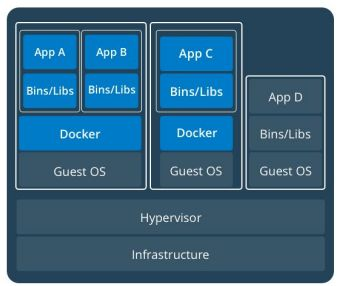
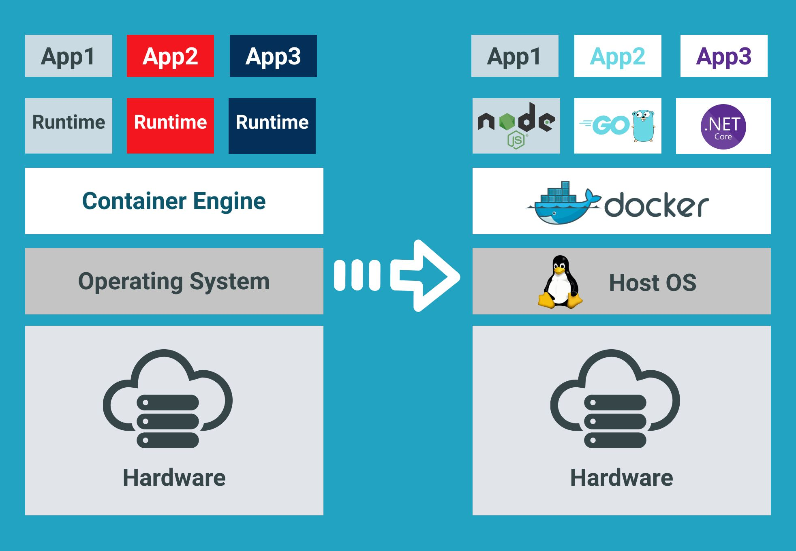
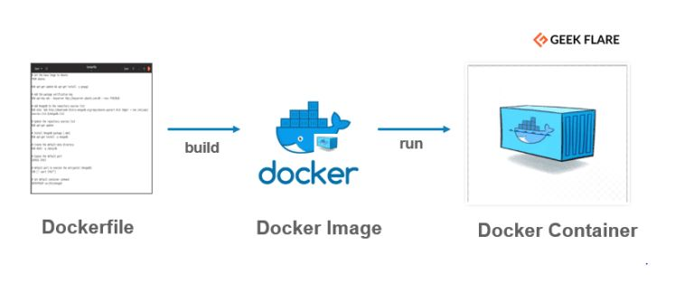
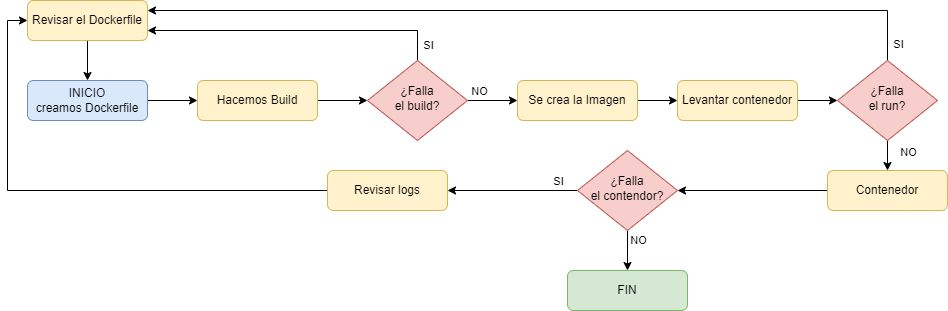

# Docker

## 0. Contenedores vs. Virtualización

Docker no es una máquina virtual, aunque a primera vista lo parezca. La diferencia está en
qué capa se virtualiza:



Cada máquina virtual arrastra un **Guest OS** completo propio — de ahí que pese gigas y
tarde minutos en arrancar. Los contenedores de la izquierda, en cambio, **comparten el mismo
Guest OS** a través del motor de Docker — solo empaquetan la app y sus binarios/librerías,
de ahí que pesen megas y arranquen en segundos. El de la derecha (App D) representa una app
sin contenedor, corriendo directamente sobre el Guest OS, para que se vea el contraste.

---

## 1. Qué es Docker

**Docker** es una plataforma de software que permite crear, probar e implementar
aplicaciones rápidamente.

Si queremos ejecutar un servicio, tradicionalmente hay que instalarlo directamente en una
máquina Linux o Windows. Docker proporciona ese mismo servicio **sin instalarlo en la
máquina anfitriona**, lo que nos permite abstraernos completamente del entorno — el
servicio y sus dependencias viajan siempre juntos, empaquetados.

!!! example "Aplicado a DWEC"
    En este módulo, Node, npm y Vite corren dentro de un contenedor Docker — no están
    instalados en tu equipo. VS Code se conecta directamente dentro de ese contenedor
    (extensión Dev Containers), así que el terminal integrado que usas cada día **ya es el
    terminal del contenedor**. Cuando ejecutas `npm run dev` y luego abres `localhost:5173`
    en tu navegador, lo que está pasando por debajo es justo lo que se explica en la sección
    de **mapeo de puertos**, más abajo.



A la izquierda, cada aplicación necesita su propio *runtime* instalado directamente sobre el
sistema operativo. A la derecha, Docker se sitúa como una capa única entre el sistema
operativo anfitrión y todas las aplicaciones — cada una trae su propio entorno (Node, Go,
.NET...) empaquetado dentro de su contenedor, sin tener que instalar nada de eso en el host.

!!! tip "Fortalezas"
    - **Ligereza:** un contenedor, por lo general, pesa muy poco (ej. `nginx:alpine` son
      solo 15 MB).
    - **Repositorios y repetibilidad:** facilidad para compartir contenedores en
      repositorios y moverlos entre entornos de desarrollo. Se crean a través de un archivo
      `Dockerfile`.
    - **Orquestación:** junto a los contenedores existen multitud de herramientas para su
      monitorización, despliegue, autoescalado, etc.
    - **Entorno local de desarrollo:** posibilidad de levantar entornos con facilidad, con
      varios contenedores trabajando entre ellos.
    - **Entornos de ejecución de pruebas:** entornos dinámicos con autoescalado para
      ejecución de pruebas unitarias o de integración.

!!! warning "Debilidades"
    - **Dificultad:** migrar aplicaciones enteras a Docker puede suponer un incremento de la
      complejidad de mantenimiento.
    - **Seguridad:** al compartir el kernel del host, existe la posibilidad de que una
      vulnerabilidad en el mismo afecte a todos los contenedores que corren sobre él.

---

## 2. Definiciones

| Concepto | Descripción |
|---|---|
| **Image (Imagen)** | Un archivo inerte e inmutable que es básicamente un *snapshot* de un contenedor. Similar al concepto de ISO. Se versionan. |
| **Dockerfile** | El archivo en el que se definen las instrucciones necesarias para crear una imagen de Docker. |
| **Container (Contenedor)** | Una imagen de Docker en funcionamiento — la imagen ejecutándose. |
| **Registry** | Repositorio donde se suben las imágenes de Docker. Docker ofrece **DockerHub** para uso gratuito. |
| **Volumes** | El almacenamiento de un contenedor es efímero: cuando el contenedor se para, los datos internos desaparecen. Docker permite montar volúmenes que persisten más allá de la vida del contenedor. |

---

## 3. Flujo de Trabajo: Elementos



Generamos un fichero `Dockerfile` para construir después una imagen. Una vez realizado este
proceso, levantamos esa imagen para usar el servicio instalado en ella.

---

## 4. ¿Qué es un Fichero Dockerfile?

Es un simple archivo de texto con un conjunto de comandos o instrucciones. Estos
comandos/instrucciones se ejecutan sucesivamente para realizar acciones sobre la imagen base
y así crear una nueva imagen Docker.

**Es un archivo sin extensión** (se llama literalmente `Dockerfile`, sin `.txt` ni nada
detrás).

### Comandos básicos de un Dockerfile

| Comando | Descripción |
|---|---|
| `FROM` | Define la imagen base que se utilizará para iniciar el proceso de compilación. |
| `WORKDIR` | Define el directorio de trabajo dentro del contenedor — todos los comandos siguientes (`RUN`, `COPY`, `CMD`...) se ejecutan relativos a esta carpeta. |
| `RUN` | Toma el comando y sus argumentos para ejecutarlo **durante la construcción** de la imagen. |
| `CMD` | Define el comando que se ejecuta al **arrancar** el contenedor — se puede sobrescribir fácilmente al lanzar `docker run`. |
| `ENTRYPOINT` | Define el comando que se ejecuta al arrancar el contenedor, igual que `CMD`, pero **no se sobrescribe** por accidente — pensado para contenedores con un único propósito claro. |
| `COPY` / `ADD` | Copia los archivos del origen al destino (dentro del contenedor). |
| `ENV` | Establece variables de entorno. |
| `EXPOSE` | Documenta qué puerto usa el servicio dentro del contenedor (no lo hace accesible por sí solo — ver mapeo de puertos más abajo). |

Documentación de referencia: [docs.docker.com/engine/reference/builder](https://docs.docker.com/engine/reference/builder/)

### `RUN` vs. `CMD` vs. `ENTRYPOINT` — la confusión más común

!!! warning "Los tres ejecutan algo, y por eso se confunden"
    La diferencia real está en **cuándo**:

- **`RUN`** se ejecuta **una vez, al construir la imagen** (`docker build`). Sirve para dejar
  cosas instaladas dentro de la imagen (ej. `RUN npm install`). No vuelve a ejecutarse nunca
  más una vez la imagen está construida.
- **`CMD`** y **`ENTRYPOINT`** se ejecutan **cada vez que arranca un contenedor** a partir de
  esa imagen (`docker run`). No instalan nada — lanzan el proceso principal del contenedor.

```dockerfile
FROM node:20
WORKDIR /app
COPY . .
RUN npm install          # Se ejecuta UNA VEZ, al hacer "docker build"
CMD ["npm", "run", "dev"] # Se ejecuta CADA VEZ que se hace "docker run"
```

**La diferencia entre `CMD` y `ENTRYPOINT`:** con `CMD`, si lanzas
`docker run mi-imagen npm run build`, ese `npm run build` sustituye por completo al `CMD` del
Dockerfile. Con `ENTRYPOINT`, en cambio, lo que escribas después en `docker run` se **añade**
como argumento al `ENTRYPOINT`, no lo sustituye — se usa cuando quieres que el contenedor
haga siempre lo mismo pase lo que pase. Para el día a día de este módulo, `CMD` es
suficiente en la inmensa mayoría de los casos.

### Ejemplo de Dockerfile

```dockerfile
# Usa una imagen base de Apache
FROM httpd:2.4

# Copia tus archivos de configuración personalizados de local al contenedor
# COPY ./mi-configuracion.conf /usr/local/apache2/conf/mi-configuracion.conf

# Puerto por defecto para Apache
EXPOSE 80

# Inicia el servidor Apache
CMD ["httpd", "-D", "FOREGROUND"]
```

### El Compañero Inseparable del Dockerfile: `.dockerignore`

Cuando usas `COPY . .` para copiar tu proyecto al contenedor, Docker copia **literalmente
todo** lo que haya en esa carpeta — incluida `node_modules` (que puede pesar cientos de MB y
además puede tener binarios compilados para tu sistema operativo, no para el del
contenedor), o la carpeta `.git` entera.

`.dockerignore` funciona exactamente como un `.gitignore`, pero para decirle a Docker qué
**no** copiar:

```
# .dockerignore
node_modules
.git
.env
*.log
```

!!! warning "Por qué importa de verdad"
    Sin él, tus builds son más lentos (copiar más datos de los necesarios), tu imagen final
    pesa mucho más de lo que debería, y en el peor caso puedes arrastrar un `node_modules`
    instalado en tu Windows/Mac dentro de un contenedor Linux, con dependencias que no
    funcionan ahí — justo el tipo de "en mi máquina funciona" que Docker existe para evitar.

---

## 5. ¿Qué es una Imagen?

Una **imagen de Docker** es una plantilla de solo lectura que define un contenedor. La
imagen contiene el código que se ejecutará, incluida cualquier definición para cualquier
biblioteca o dependencia que ese código necesite.

Docker tiene su propio repositorio de imágenes prediseñadas con servicios ya desarrollados,
tales como: Apache, Nginx, Node.js, Redis...

Repositorio de imágenes: [Docker Hub](https://hub.docker.com/)

### Las Imágenes se Construyen por Capas (*Layers*)

Cada instrucción de un `Dockerfile` (`FROM`, `RUN`, `COPY`...) no se ejecuta "de golpe": crea
una **capa** independiente, y Docker guarda esa capa en caché.

```dockerfile
FROM node:20        # Capa 1
COPY package.json .  # Capa 2
RUN npm install       # Capa 3 -- la más lenta, instala dependencias
COPY . .              # Capa 4 -- tu código, que cambia constantemente
```

!!! tip "Por qué importa esto en la práctica"
    Si solo cambias una línea de tu código (`COPY . .`, la última capa) y vuelves a construir
    la imagen, Docker **reutiliza las capas anteriores desde caché** en vez de reinstalar
    todas las dependencias otra vez — por eso el segundo `docker build` de un proyecto es
    mucho más rápido que el primero. Por esta misma razón, en un `Dockerfile` real siempre se
    copian primero los ficheros que cambian poco (`package.json`) y se instalan las
    dependencias, y solo al final se copia el resto del código — así los cambios en tu código
    no invalidan la capa (larga) de `npm install`.

---

## 6. ¿Qué es un Contenedor?

En base a la imagen generada anteriormente, un **contenedor Docker** es esa misma imagen
**ejecutada**. Esto nos permite tener un entorno que puede estar basado en diferentes
sistemas Linux (Debian, Ubuntu, CentOS...) con un servicio ejecutándose en su interior:
Apache, Nginx, Redis, etc.

Es similar a una máquina virtual de VirtualBox, pero mucho más ligero, puesto que no tiene
instalado nada que no sea el propio servicio que está ofreciendo.

!!! danger "Los Contenedores son Efímeros — y esto sorprende a todo el mundo la primera vez"
    En un ordenador normal, un archivo que creas se queda ahí hasta que tú lo borras. En un
    contenedor, **no** — si el contenedor se elimina, todo lo que hayas creado dentro de él
    (sin usar un volumen) desaparece con él, sin avisar ni pedir confirmación.

```bash
docker run -it --name prueba ubuntu bash
# Dentro del contenedor:
echo "hola" > /archivo.txt
exit

docker rm prueba          # Eliminas el contenedor
docker run -it --name prueba2 ubuntu bash
cat /archivo.txt          # Error: No such file or directory -- ¡nunca existió aquí!
```

`/archivo.txt` vivía **solo dentro de aquel contenedor concreto**, no en la imagen `ubuntu`
ni en ningún sitio persistente. Al borrar el contenedor, se borró con él. Esta es
precisamente la razón de que existan los **volúmenes** (sección 2): cualquier dato que
necesites que sobreviva a la vida de un contenedor concreto — una base de datos, ficheros
subidos por un usuario — tiene que vivir en un volumen, nunca "suelto" dentro del contenedor.

---

## 7. Comandos Docker

### Comandos básicos

```bash
docker --version              # Encontrar la versión instalada
docker build -t first-image . # Construye la imagen a partir del Dockerfile, con el nombre "first-image"
docker pull httpd             # Descarga una imagen
docker images                 # Lista las imágenes disponibles en local
docker run -it -d httpd       # Crea un contenedor a partir de la imagen httpd (Apache)
docker ps                     # Lista los contenedores en ejecución, con sus detalles
docker ps -a                  # Lista TODOS los contenedores (en ejecución, salidos o parados)
docker network ls             # Lista los detalles de toda la red del clúster
```

### Los Flags Más Usados de `docker run`, Explicados

Verás estos flags constantemente y se combinan entre sí — merece la pena saber qué hace cada
uno por separado:

| Flag | Qué hace |
|---|---|
| `-d` | (*detached*) Arranca el contenedor en segundo plano y te devuelve el terminal al momento. |
| `-it` | Combinación de `-i` (*interactive*, mantiene abierta la entrada estándar) + `-t` (asigna una terminal). Úsalo cuando quieras **escribir dentro** del contenedor, como en una sesión de `bash`. |
| `--rm` | Elimina el contenedor automáticamente en cuanto termina de ejecutarse. Ideal para contenedores de usar y tirar (probar algo rápido), para no dejar basura acumulada. |
| `--name` | Le da un nombre concreto al contenedor, para no tener que usar el ID largo y aleatorio en comandos posteriores. |

!!! warning "Importante"
    `-it` y `-d` casi nunca tienen sentido juntos en el mismo `docker run` — uno pide una
    terminal interactiva delante de ti, el otro manda el proceso a segundo plano sin
    terminal. Si quieres entrar más tarde a un contenedor que ya arrancó en segundo plano con
    `-d`, usa `docker exec -it <contenedor> bash` en vez de mezclar los flags al arrancarlo.

### Mapeo de Puertos (`-p`) — por qué funciona `localhost` en tu navegador

Un contenedor vive en su propia red aislada — por defecto, **nada de fuera puede acceder a
un puerto suyo**, aunque el servicio de dentro esté funcionando perfectamente. `EXPOSE` en el
Dockerfile solo **documenta** qué puerto usa el servicio; no lo hace accesible.

Para que tu navegador (fuera del contenedor) pueda hablar con un servicio de dentro, hay que
**mapear** un puerto de tu máquina a un puerto del contenedor con el flag `-p`:

```bash
docker run -p 5173:5173 mi-imagen
#           │    │
#           │    └── puerto DENTRO del contenedor (donde escucha el servicio)
#           └─────── puerto en TU máquina (localhost) que se conecta a él
```

Con esto, todo lo que llega a `localhost:5173` en tu navegador se redirige automáticamente
al puerto `5173` de dentro del contenedor.

!!! example "Aplicado a DWEC"
    Esto es exactamente lo que hace VS Code por ti automáticamente cuando trabajas con Dev
    Containers — por eso nunca has tenido que escribir este comando a mano en clase, pero es
    justo lo que ocurre por debajo cada vez que abres `localhost:5173` tras un `npm run dev`.

### Comandos sobre un contenedor concreto

Patrón general: `docker [comando] [contenedor_id]`

```bash
docker rm 9b6343d3b5a0        # Elimina el contenedor
docker rmi fce289e99eb9       # Elimina una imagen
docker restart 09ca6feb6efc   # Reinicia el contenedor
docker stop 09ca6feb6efc      # Para el contenedor
docker start 09ca6feb6efc     # Inicia el contenedor
docker kill 9b6343d3b5a0      # Mata el contenedor (parada forzosa, sin gracia)
docker logs 9b6343d3b5a0      # Muestra los logs del contenedor
docker exec -it 9b6343d3b5a0 bash  # Accede al contenedor y ejecuta comandos dentro de él
```

Referencia completa de comandos: [geekflare.com/es/docker-commands](https://geekflare.com/es/docker-commands/)

---

## 8. Logs

La herramienta **Docker Logs** se utiliza para obtener los logs o registros de un
contenedor. Recupera por lotes los logs presentes en el momento de la ejecución del comando.

```bash
docker logs -f "nombre_del_contenedor"
```

El flag `-f` (*follow*) mantiene el log abierto en tiempo real, en vez de mostrar solo una
foto fija del momento.

---

## 9. Diagrama de Trabajo



Referencia: [geekflare.com/es/docker-commands](https://geekflare.com/es/docker-commands/)

---

## 10. Docker Hub

**Docker Hub** es un *Docker Registry* público donde subir nuestras imágenes. Permite
registrarnos gratuitamente y subir nuestros contenedores de forma pública, además de
explorar repositorios oficiales de otros servicios.

Crear una cuenta en [hub.docker.com](https://hub.docker.com/)

**Pasos para publicar una imagen:**

1. Registro en Docker Hub y creación de nuestro primer repositorio **público**.
2. Usar el comando `docker login` para autenticar nuestro equipo en ese repositorio.
3. Cambiar el *tag* de nuestro contenedor para ajustarlo al repositorio recién creado, y
   subir la imagen con `docker push`.

```bash
# login
cat password.txt | docker login --username demo --password-stdin

# tag images
docker tag "imagen_local" "repositorio/imagen_local"

# push imagen
docker push repositorio/imagen_local
```

---

## 11. Docker Compose

**El escenario:** imagina una aplicación compuesta por Node.js, MongoDB y Redis —
tres servicios distintos que tienen que funcionar juntos.

**La frustración de gestionarlo a base de `docker run` suelto:**

- Necesitas recordar el orden de ejecución (primero la base de datos, luego la app).
- Configuración manual de `--network` para que los contenedores se puedan comunicar entre
  sí.
- Variables de entorno kilométricas escritas a mano en la terminal.
- Dificultad para replicar exactamente el mismo entorno en el equipo de un compañero.

**Docker Compose** resuelve exactamente este problema: describe todos los servicios, sus
redes y sus variables de entorno en un único fichero (`docker-compose.yml`), y los levanta
todos juntos, en el orden correcto, con un solo comando.

### 11.1. ¿Qué es exactamente Docker Compose?

Es una **herramienta de orquestación** — no crea ningún concepto nuevo respecto a lo que ya
sabes (sigue habiendo imágenes, contenedores, volúmenes, puertos), simplemente lee un fichero
de configuración (`docker-compose.yml`) y ejecuta, por ti, todos los `docker run` con sus
flags correspondientes, en el orden correcto, conectados a la misma red.

Piensa en ello como la diferencia entre encender uno a uno los electrodomésticos de una
cocina, o pulsar un único interruptor general que los enciende todos en el orden correcto.

### 11.2. Anatomía de un `docker-compose.yml`, explicada línea a línea

```yaml
services:
  app:
    build: .
    ports:
      - "5173:5173"
    depends_on:
      - mongo
    environment:
      - DB_HOST=mongo
    volumes:
      - .:/app

  mongo:
    image: mongo:7
    volumes:
      - datos_mongo:/data/db

volumes:
  datos_mongo:
```

| Clave | Qué hace |
|---|---|
| `services:` | La lista de contenedores que forman tu aplicación. Cada uno definido debajo es un servicio independiente. |
| `app:` / `mongo:` | El **nombre** que le das a cada servicio. No es decorativo: este nombre es el que usan los demás servicios para encontrarlo en la red (ver más abajo). |
| `build: .` | "Construye la imagen de este servicio a partir del `Dockerfile` que hay en esta misma carpeta." Se usa cuando el servicio es **tu propio código**. |
| `image: mongo:7` | "Usa directamente esta imagen ya existente de Docker Hub, no hace falta construir nada." Se usa para servicios de terceros (bases de datos, colas de mensajes...) que no vas a modificar. |
| `ports:` | Mapeo de puertos — es el mismo `-p` host:contenedor que ya viste con `docker run`, solo que en formato lista. |
| `depends_on:` | Controla el **orden de arranque**: `app` no empieza a levantarse hasta que el contenedor de `mongo` ha arrancado. *(Ojo: lee el aviso más abajo — "arrancado" no es lo mismo que "listo para recibir conexiones".)* |
| `environment:` | Variables de entorno para ese servicio — el equivalente en Compose al flag `-e` de `docker run`. |
| `volumes:` (dentro de un servicio) | Qué se monta y dónde. Puede ser un volumen con nombre (`datos_mongo:/data/db`) o un *bind mount* (`.:/app` — sigue leyendo). |
| `volumes:` (al final, fuera de `services`) | Declara los volúmenes con nombre que se usan arriba, para que Docker los cree y los gestione. |

### 11.3. Dos tipos de `volumes` muy distintos — y uno es justo lo que usa tu Dev Container

**Volumen con nombre** (`datos_mongo:/data/db`): Docker gestiona dónde se guarda físicamente
ese dato. Lo usas para datos que quieres que **persistan** (como la base de datos), pero que
no necesitas mirar ni editar tú directamente desde fuera del contenedor.

**Bind mount** (`.:/app`): conecta directamente una carpeta de **tu máquina** (`.`, la carpeta
actual) con una carpeta **dentro del contenedor** (`/app`). Cualquier cambio que hagas en tu
editor se refleja al instante dentro del contenedor, y viceversa — son literalmente la misma
carpeta vista desde dos sitios.

!!! example "Aplicado a DWEC"
    Esto es exactamente lo que hace posible Dev Containers. Cuando editas un archivo en VS
    Code y ves el cambio reflejado al instante dentro del contenedor (sin tener que
    reconstruir ni copiar nada), es un *bind mount* trabajando por debajo — tu carpeta del
    proyecto está montada dentro del contenedor, no copiada.

### 11.4. Cómo se comunican los servicios entre sí

Docker Compose crea automáticamente una **red privada** compartida por todos los servicios
del mismo fichero. Dentro de esa red, cada servicio puede llamar a los demás **usando su
nombre como si fuera un dominio** — no hace falta averiguar ninguna IP:

```js
// Dentro del contenedor "app", esto FUNCIONA:
mongoose.connect("mongodb://mongo:27017/miapp");
//                          └─┬─┘
//                 el nombre del servicio en docker-compose.yml,
//                 Docker lo resuelve automáticamente
```

Esto solo funciona **entre contenedores de la misma red de Compose** — tu navegador, que
está fuera de esa red, nunca podría usar `mongo` como si fuera una URL real; para el
navegador todo pasa siempre por `localhost` y el puerto mapeado.

### 11.5. Comandos de Docker Compose

```bash
docker compose up            # Construye (si hace falta) y levanta TODOS los servicios
docker compose up -d         # Igual, pero en segundo plano (recuperas el terminal)
docker compose up --build    # Fuerza reconstruir las imágenes, aunque ya existan
docker compose down          # Para y ELIMINA los contenedores (los volúmenes con nombre se conservan)
docker compose down -v       # Igual, pero además borra los volúmenes con nombre (¡pierdes los datos!)
docker compose ps            # Lista el estado de los servicios de ESTE proyecto
docker compose logs          # Logs de todos los servicios a la vez
docker compose logs -f app   # Logs en tiempo real de un único servicio ("app")
docker compose exec app sh   # Abre una terminal dentro del contenedor "app" (equivalente a "docker exec")
docker compose restart app   # Reinicia solo un servicio, sin tocar los demás
```

### 11.6. El error más común: `depends_on` no espera a que el servicio esté "listo"

!!! danger "Arrancado no es lo mismo que listo para recibir conexiones"
    `depends_on` solo garantiza que Docker **arranca** `mongo` antes que `app` — no que
    MongoDB ya esté aceptando conexiones cuando `app` empiece a ejecutarse. Un contenedor
    puede tardar unos segundos en estar realmente operativo por dentro, aunque el contenedor
    ya figure como "iniciado".

    **Síntoma típico:** tu `app` falla al conectar a la base de datos justo al arrancar todo
    con `docker compose up`, pero funciona perfectamente si la reinicias 5 segundos después
    (`docker compose restart app`) — porque para entonces `mongo` ya estaba listo de verdad.

**Cómo se soluciona en proyectos reales:** con lógica de reintento en el propio código de la
app (reintentar la conexión unas cuantas veces con una pequeña espera entre intentos), o con
una condición de `healthcheck` en el `docker-compose.yml` (más avanzado, lo verás si trabajas
con Compose en profundidad más adelante).

---

## 12. Docker Más Allá de Este Módulo

Todo lo anterior lo has visto aplicado a DWEC, pero Docker no es una herramienta de esta
asignatura — es una pieza estándar de la industria que te vas a encontrar en casi cualquier
módulo o puesto de trabajo relacionado con desarrollo o sistemas. Esto es lo que conviene que
reconozcas aunque no lo domines todavía:

### Docker Desktop — cómo lo vas a instalar tú mismo

En este módulo ya tienes el contenedor preparado de antemano, pero en otras asignaturas (o en
tu propio ordenador) probablemente necesites instalarlo tú. **Docker Desktop** es la
aplicación oficial con interfaz gráfica para Windows y macOS — instala por debajo el mismo
motor de Docker que has usado aquí por terminal, pero añade una ventana donde puedes ver tus
imágenes, contenedores y volúmenes con clics en vez de comandos. En Linux, se suele instalar
directamente el motor (*Docker Engine*) sin la capa gráfica, porque el terminal ya es nativo
del sistema.

### El Siguiente Escalón: Kubernetes

Docker Compose es perfecto para levantar 2-5 servicios en tu propio ordenador o en un único
servidor. Pero, ¿qué pasa cuando una empresa necesita ejecutar **cientos** de contenedores,
repartidos en decenas de servidores, que además tienen que reiniciarse solos si fallan y
multiplicarse automáticamente si hay mucho tráfico? Para eso existe **Kubernetes** (a menudo
abreviado *K8s*) — un orquestador de contenedores a gran escala. No es tema de este módulo,
pero es el nombre que verás constantemente en ofertas de trabajo junto a "Docker", y ahora
ya sabes qué problema resuelve cada uno: Docker empaqueta y ejecuta; Kubernetes decide
**dónde, cuántas copias y qué hacer si algo falla**, cuando la escala ya no cabe en un
`docker-compose.yml`.

### Dónde te lo vas a encontrar en la práctica

- **Integración Continua (CI/CD):** cuando subes código a GitHub, es muy común que se ejecute
  automáticamente dentro de un contenedor Docker para compilarlo y testearlo en un entorno
  limpio e idéntico cada vez — ni tu sistema operativo ni lo que tengas instalado localmente
  afecta al resultado.
- **Despliegue en la nube:** AWS, Azure y Google Cloud aceptan contenedores Docker de forma
  nativa como unidad de despliegue — "sube tu imagen y nosotros la ejecutamos" es hoy la
  forma más común de publicar una aplicación en producción.
- **Arquitecturas de microservicios:** aplicaciones grandes divididas en piezas pequeñas e
  independientes (facturación, usuarios, notificaciones...), cada una en su propio
  contenedor, que se comunican entre sí igual que viste en la sección de Docker Compose —
  solo que a mayor escala.

!!! info "Lo que te tienes que llevar de esta unidad"
    No es memorizar comandos, sino entender el **porqué** de cada pieza (imagen, contenedor,
    volumen, red, puerto) — esa base conceptual es la que se mantiene igual, uses Docker en
    DWEC, en otra asignatura, o en tu primer trabajo.

---

## 13. Redes en Docker: Topologías Multi-Red

Hasta ahora has trabajado siempre con una única red por defecto: todos los servicios de tu
`docker-compose.yml` se ven entre sí sin que tengas que pensar en ello. Eso cambia en cuanto
un proyecto necesita **más de una red** — por ejemplo, para separar una zona de servicios
internos de una zona expuesta al exterior. Esta sección explica cómo se comporta Docker en
ese caso, porque el razonamiento es el mismo se use para lo que se use: aislar una base de
datos, separar un front de un back, o construir una topología de seguridad completa.

### 13.1. El comportamiento por defecto (el punto de partida mental)

- Cada red de Docker (`bridge`) es, en esencia, un conmutador virtual: todos los contenedores
  conectados a la misma red se ven entre sí directamente, en igualdad de condiciones.
- Docker asigna automáticamente una subred y reparte IPs a los contenedores que se conectan a
  ella, salvo que se indique lo contrario.
- Por defecto, todo contenedor tiene salida a Internet a través de NAT en el host — como el
  wifi de casa, donde todo lo que hay detrás del router comparte una salida.

!!! warning "Docker no es \"seguro por defecto\" entre sus propios contenedores"
    Si metes dos servicios en la MISMA red Docker, no hay ningún control de tráfico entre
    ellos por el simple hecho de estar en Docker. El aislamiento y el filtrado hay que
    construirlos explícitamente — por defecto, una red Docker es plana.

### 13.2. Redes personalizadas: el primer nivel de segmentación

Cuando defines tus propias redes en `docker-compose.yml` (en vez de usar la red por defecto),
controlas de verdad la topología:

```yaml
networks:
  lan_net:
    driver: bridge
    ipam:
      config:
        - subnet: 10.10.10.0/24
```

Dos contenedores en redes **distintas** no se ven entre sí — ni siquiera hacen `ping` — a
menos que algo los conecte. Esa es la base real de cualquier segmentación tipo "zona interna
/ zona expuesta": no es una fantasía de diagrama, es una consecuencia directa de que sean
redes Docker diferentes.

### 13.3. La trampa de la IP `.1`

Docker reserva automáticamente la primera IP utilizable de cada subred (normalmente la `.1`)
para la puerta de enlace del propio bridge — el "router" interno que crea Docker para esa
red. Es exactamente igual que en una red doméstica: el router casi siempre es la `.1`.

!!! danger "Si asignas la IP .1 a un contenedor tuyo, choca con esa puerta de enlace"
    El síntoma no siempre es un error claro al arrancar — a veces el contenedor arranca pero
    la conectividad se comporta de forma rara. `docker network inspect <red>` muestra el
    campo `"Gateway"`: conviene comprobarlo antes de fijar IPs a mano en el `docker-compose.yml`.

### 13.4. `internal: true` — qué hace de verdad (y qué no)

Una red marcada como `internal: true` no tiene ninguna ruta de salida fuera de sí misma — ni
a Internet, ni a otra red Docker, aunque el host sí tenga conectividad. Los contenedores de
esa red solo pueden hablar entre ellos, nunca salir por su cuenta.

!!! tip "Por qué esto no basta por sí solo"
    `internal: true` aísla la red, pero no crea automáticamente un camino controlado hacia
    ella desde fuera. Ese camino hay que construirlo con un contenedor que SÍ esté conectado
    a las dos redes a la vez (*dual-homed*) — es el único punto de paso entre ambas.

### 13.5. Por qué hacen falta rutas explícitas y `NET_ADMIN`

Aquí es donde más gente se pierde, porque parece que "ya debería funcionar" y no funciona.
La secuencia lógica, paso a paso:

1. Un contenedor de `red_a` quiere hablar con uno de `red_b`. No están en la misma red, así
   que el sistema operativo del contenedor necesita saber **por dónde** llegar a esa subred
   — eso es una ruta.
2. Por defecto, un contenedor solo conoce la puerta de enlace de **su propia** red. No sabe
   nada de `red_b`.
3. Hay que añadirle una ruta estática: "para llegar a la subred de `red_b`, pasa por el
   contenedor dual-homed" — eso es lo que hace un `entrypoint.sh` con `ip route add`.
4. Modificar la tabla de rutas de un contenedor requiere la capacidad `NET_ADMIN` — sin ella,
   `ip route add` falla con `Operation not permitted`.
5. Y hace falta la ruta **en los dos sentidos**: el contenedor de destino también necesita
   saber cómo volver al origen — si solo se añade la ruta de ida, las respuestas se pierden y
   parece un fallo aleatorio de conectividad.

!!! example "El paralelismo que ayuda a entenderlo"
    Esto es literalmente lo mismo que configurar el encaminamiento entre dos redes físicas
    con un router de por medio — con máquinas virtuales harías esto mismo con `ip route` o
    con la configuración de red del sistema operativo. Docker no cambia el concepto de redes
    y rutas, solo cambia dónde vive cada máquina.

### 13.6. Cómo se resuelven los nombres entre contenedores

Docker Compose crea, para cada red personalizada, un servidor DNS interno que resuelve el
**nombre del servicio** (tal como aparece en `docker-compose.yml`) a su IP — siempre que
ambos contenedores compartan esa red. Si un contenedor necesita un nombre concreto que no
coincide con el nombre del servicio (por ejemplo, para que cuadre con un certificado TLS),
hay que decidir explícitamente si se resuelve por DNS interno de Docker (dándole ese nombre
exacto al servicio, o un alias de red) o a mano por `/etc/hosts` — y ser consistente con esa
decisión en todo lo que dependa de ese nombre.

!!! example "Aplicado a SAD"
    En el módulo de Seguridad y Alta Disponibilidad (SAD), estas ideas se llevan al extremo
    en un escenario llamado **SecureCorp**: una topología con una red `lan_net`
    (10.10.10.0/24), una red `dmz_net` (10.10.20.0/24, marcada `internal: true`) y un único
    contenedor `fw-perimeter`, dual-homed, en la IP `.2` de cada una — nunca en la `.1`,
    precisamente por la trampa explicada arriba. Los contenedores de `lan_net` solo llegan a
    los de `dmz_net` a través de rutas explícitas que pasan por `fw-perimeter`, con
    `NET_ADMIN` en cada `entrypoint.sh`, y `fw-perimeter` es quien de verdad filtra ese
    tráfico. A lo largo del curso esa misma topología se amplía con una red que simula
    Internet, un túnel VPN y una red adicional para una aplicación web — pero el mecanismo de
    base es exactamente el que se explica en esta sección.

    | Red | Subred | Tipo |
    |---|---|---|
    | `lan_net` | 10.10.10.0/24 | bridge normal — clientes internos |
    | `dmz_net` | 10.10.20.0/24 | internal — aloja el servicio protegido |
    | `internet_net` | 10.10.30.0/24 | bridge normal — simula "el exterior" |
    | `dmz_web` | 10.10.40.0/24 | internal — aloja la aplicación web |

!!! danger "Errores típicos con redes multi-red"
    - Poner un contenedor en la IP `.1` de una red personalizada (choca con el gateway
      reservado por Docker).
    - Marcar una red como `internal` y esperar que aun así tenga salida a Internet o a otra
      red — no la tiene, ni la tendrá, sin un contenedor dual-homed.
    - Añadir la ruta de ida (cliente → servidor) y olvidar la de vuelta (servidor → cliente)
      — la conectividad falla de forma asimétrica y es difícil de diagnosticar.
    - Aplicar reglas o rutas a mano dentro de un contenedor ya arrancado, sin guardarlas en el
      `Dockerfile`/`entrypoint` — funcionan hasta el siguiente `docker compose restart` o
      `down && up`, momento en el que "desaparece la magia".
    - Confundir `NET_ADMIN` (capacidad para tocar la configuración de red de UN contenedor)
      con tener control sobre la red de Docker en general — son cosas distintas.