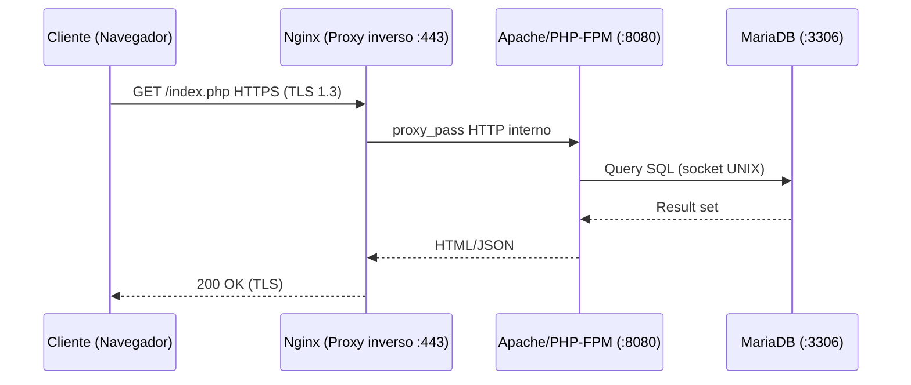

# UD1: Arquitectura Web, Protocolos y Entornos de Desarrollo

!!! info "Ficha Técnica y Alcance de la Unidad"
    * **Carga Lectiva:** 5 horas presenciales
    * **Resultados de Aprendizaje:** RA1 (criterios a, b, c)
    * **Tecnologías Involucradas:** [HTTP/HTTPS](tech/http-tls.md)
    * **Referencias y Estándares:** RFC 9110 (HTTP Semantics), RFC 9113 (HTTP/2), RFC 8446 (TLS 1.3), NIST SP 800-52

---

## 📖 1. Fundamentos Teóricos y Arquitectura

### 1.1 Antes de empezar: ¿qué es realmente "una aplicación web"?

Cuando escribes una URL en el navegador (por ejemplo `https://app.iaw.local`) y aparece una página,
en realidad han ocurrido varias cosas en cuestión de milisegundos, entre dos ordenadores distintos
que ni siquiera están en el mismo edificio:

1. Tu navegador (el **cliente**) necesita saber a qué dirección IP corresponde ese nombre. Para eso
   consulta un **DNS** (*Domain Name System*), que funciona como una agenda de contactos: le das un
   nombre ("app.iaw.local") y te devuelve un número (una IP, p. ej. `192.168.1.50`).
2. Con esa IP, el navegador abre una conexión de red hacia un **puerto** concreto de esa máquina
   (el 443 si es HTTPS, el 80 si es HTTP sin cifrar) — un puerto es simplemente un número que identifica
   *qué programa* de ese ordenador debe atender la petición, igual que un número de apartamento
   identifica a quién va dirigida una carta dentro de un edificio.
3. Al otro lado, un programa llamado **servidor web** (Apache, Nginx...) está escuchando en ese
   puerto, permanentemente encendido, esperando peticiones.
4. Cliente y servidor "hablan" siguiendo unas reglas comunes acordadas de antemano: eso es un
   **protocolo**. Para la web, ese protocolo es **HTTP** (o su versión cifrada, HTTPS).
5. El servidor procesa la petición (puede ser tan simple como leer un fichero HTML del disco, o tan
   complejo como consultar una base de datos y generar la página al vuelo) y devuelve una
   **respuesta**.

A este modelo, en el que un programa pide algo (cliente) y otro lo atiende (servidor), se le llama
**arquitectura cliente-servidor**, y es la base de prácticamente toda la informática en red: no solo
la web, también el correo electrónico, la mensajería, los videojuegos online, etc.

!!! tip "Buenas Prácticas Sysadmin / DevOps"
    Analogía útil para el aula: el cliente es como un comensal en un restaurante, el servidor es la
    cocina. El comensal no entra a cocinar; pide un plato (la petición) siguiendo una carta con
    formato conocido (el protocolo), y la cocina responde con el plato preparado (la respuesta).
    Varios comensales pueden pedir a la vez sin molestarse entre sí: eso es lo que veremos en UD2/UD3
    cuando hablemos de cómo un servidor atiende a *muchos* clientes simultáneamente.

### 1.2 El protocolo HTTP: la "gramática" de la conversación

**HTTP** (*HyperText Transfer Protocol*) define exactamente cómo debe ser el mensaje que envía el
cliente y cómo debe ser la respuesta del servidor, para que ambos se entiendan sin ambigüedad —
igual que un formulario oficial tiene campos fijos que rellenar en un orden concreto. El **RFC 9110**
es el documento internacional (de la IETF, el organismo que estandariza los protocolos de Internet)
que define esta gramática. No hace falta memorizarlo, pero sí entender sus piezas clave:

**Métodos** (qué se quiere hacer):

| Método | Uso típico |
|---|---|
| `GET` | Pedir un recurso (una página, una imagen) sin modificar nada en el servidor |
| `POST` | Enviar datos al servidor (p. ej. el contenido de un formulario) |
| `PUT` | Reemplazar un recurso existente por completo |
| `DELETE` | Eliminar un recurso |
| `PATCH` | Modificar parcialmente un recurso |

**Códigos de estado** (cómo responde el servidor):

| Rango | Significado | Ejemplo típico |
|---|---|---|
| `2xx` | Éxito | `200 OK` |
| `3xx` | Redirección | `301 Moved Permanently` |
| `4xx` | Error del cliente | `404 Not Found` (recurso inexistente) |
| `5xx` | Error del servidor | `500 Internal Server Error` |

Una petición y respuesta HTTP reales (simplificadas) tienen este aspecto — esto es exactamente lo
que viaja por la red cuando pides una página:

```text title="Petición HTTP real (lo que envía el navegador)"
GET /index.html HTTP/1.1
Host: app.iaw.local
User-Agent: Mozilla/5.0
Accept: text/html
```

```text title="Respuesta HTTP real (lo que devuelve el servidor)"
HTTP/1.1 200 OK
Content-Type: text/html; charset=utf-8
Content-Length: 1256

<html>...</html>
```

El transporte concreto de ese mensaje (HTTP/1.1 tradicional, HTTP/2 sobre RFC 9113 con multiplexado,
o HTTP/3 sobre QUIC) puede cambiar la *forma* de enviarlo por la red, pero no cambia el *significado*
de los métodos y códigos de estado — de ahí que HTTP/2 y HTTP/3 sean compatibles con aplicaciones
escritas pensando solo en HTTP/1.1.



### 1.3 ¿Dónde se ejecuta el código? Cliente vs. servidor

Es habitual confundir estos dos conceptos al principio, así que conviene fijarlos bien:

- **Procesamiento en el entorno cliente:** código que se ejecuta *dentro del navegador* del usuario
  (JavaScript manipulando el DOM, validaciones visuales de un formulario antes de enviarlo). El
  usuario puede ver ese código con "Ver código fuente" o las herramientas de desarrollador.
- **Procesamiento en el entorno servidor:** código que se ejecuta *en la máquina del servidor*, antes
  de enviar la respuesta (PHP-FPM en UD2/UD4, WSGI/ASGI de Python en UD5). El usuario **nunca** ve
  este código, solo el resultado (HTML/JSON) que el servidor decide enviarle.

Esta distinción es la base de todo el módulo: en las próximas unidades instalaremos y configuraremos
precisamente los programas que hacen ese "procesamiento en el entorno servidor".

### 1.4 ¿Por qué HTTPS y no solo HTTP? Fundamentos de cifrado para quien no ha visto criptografía

HTTP por sí solo viaja **en texto plano**: cualquiera que intercepte el tráfico de red (en una wifi
pública, por ejemplo) puede leer usuario y contraseña de un formulario de login como si leyera una
postal sin sobre. **TLS** (*Transport Layer Security*) es la capa que cifra esa comunicación —
HTTPS es, literalmente, "HTTP sobre TLS".

Para entenderlo sin entrar aún en las matemáticas: TLS combina dos tipos de cifrado:

- **Cifrado asimétrico** (clave pública/privada): se usa solo al principio de la conexión (el
  *handshake*) para que cliente y servidor se pongan de acuerdo de forma segura en un secreto
  compartido, sin haberse visto antes. Es como si dos personas pudieran acordar una clave secreta
  gritándosela en una plaza llena de gente, sin que nadie más pudiera deducirla.
- **Cifrado simétrico** (una única clave compartida): una vez acordado ese secreto, se usa para
  cifrar/descifrar todo el tráfico real, porque es mucho más rápido computacionalmente.

Un **certificado digital** (fichero `.crt`) es el documento que demuestra que una clave pública
pertenece realmente a "app.iaw.local" y no a un impostor — lo emite una **Autoridad de Certificación**
(CA) de confianza (o, como haremos en el laboratorio, lo autofirmamos para pruebas).

**TLS 1.3** (RFC 8446) es la versión actual del protocolo: reduce el *handshake* a un único
*round-trip* (0-RTT en reconexiones) y elimina cifrados obsoletos (RC4, CBC estático), siendo el
mínimo exigido por NIST SP 800-52 Rev.2 para servicios federales — referencia de facto en auditorías
de seguridad.

## ⚙️ 2. Instalación, Configuración Avanzada y Hardening

!!! example "Laboratorio / Despliegue Real"
    Entorno base: Debian 12 / Ubuntu Server 24.04 LTS. Estos comandos preparan una máquina virtual
    o física recién instalada para empezar a trabajar como servidor.

```bash title="Preparación del sistema base" linenums="1"
apt update && apt full-upgrade -y
apt install -y curl gnupg2 ca-certificates lsb-release apt-transport-https
timedatectl set-ntp true          # Sincronización horaria obligatoria: validación de certificados X.509
ufw allow 80,443/tcp
```

!!! note "Base Teórica y RFCs"
    `timedatectl set-ntp true` no es opcional: los certificados TLS tienen fecha de validez ("no
    antes de", "no después de"); si el reloj del servidor está desajustado, puede rechazar
    certificados válidos o aceptar certificados ya caducados. `ufw allow 80,443/tcp` abre en el
    cortafuegos del propio sistema los dos puertos estándar de la web (80 = HTTP, 443 = HTTPS).

Generación de un certificado autofirmado de laboratorio (en producción usaríamos Let's Encrypt/ACME,
un servicio gratuito que automatiza la emisión de certificados válidos reconocidos por navegadores):

```bash title="Certificado de prueba ECDSA P-256" linenums="1"
mkdir -p /etc/ssl/lab
openssl req -x509 -nodes -newkey ec \
  -pkeyopt ec_paramgen_curve:prime256v1 \
  -keyout /etc/ssl/lab/lab.key -out /etc/ssl/lab/lab.crt \
  -days 365 -subj "/CN=app.iaw.local"
chmod 600 /etc/ssl/lab/lab.key
```

`lab.key` es la **clave privada** (nunca se comparte, de ahí `chmod 600`: solo el propietario puede
leerla) y `lab.crt` es el **certificado público** que sí se envía a cada cliente que se conecta.

!!! danger "Seguridad y Hardening (CIS / CCN-CERT / OWASP)"
    Usar siempre curvas ECDSA (`prime256v1`/`secp384r1`) frente a RSA-2048 en nuevas implementaciones:
    menor coste computacional por *handshake* con equivalente nivel de seguridad (CNSA 1.0 / CCN-STIC 807).

## 🛠️ 3. Laboratorio Práctico Dirigido

```bash title="Verificación de protocolo negociado con OpenSSL" linenums="1"
openssl s_client -connect app.iaw.local:443 -tls1_3 -brief
```

```bash title="Prueba de cabeceras HTTP con curl" linenums="1"
curl -svo /dev/null https://app.iaw.local/ 2>&1 | grep -E "SSL connection|HTTP/"
```

Comprobar el resultado esperado: `SSL connection using TLSv1.3 / TLS_AES_256_GCM_SHA384` y
`HTTP/2 200`. Si en vez de eso aparece un error de conexión, lo más probable es que aún no haya
ningún servidor web escuchando en el puerto 443 — eso es precisamente lo que instalaremos en UD2 y
UD3. Documentar en la memoria de prácticas el *cipher suite* negociado y justificar su elección.

## 🛡️ 4. Seguridad, Logs y Optimización de Rendimiento

`openssl s_client` y herramientas como `testssl.sh` permiten auditar la superficie TLS expuesta.
Cabeceras de seguridad mínimas a exigir desde esta UD (se configurarán en UD2/UD3):

| Cabecera | Valor recomendado | ¿Para qué sirve? | Referencia |
|---|---|---|---|
| `Strict-Transport-Security` | `max-age=63072000; includeSubDomains; preload` | Obliga al navegador a usar siempre HTTPS con ese dominio, incluso si el usuario teclea `http://` | OWASP ASVS V9 |
| `X-Content-Type-Options` | `nosniff` | Evita que el navegador intente "adivinar" el tipo de un fichero, lo que podría ejecutar contenido malicioso disfrazado | OWASP Cheat Sheet Series |
| `Content-Security-Policy` | política restrictiva por defecto | Limita desde qué orígenes se puede cargar JavaScript/CSS, mitigando ataques XSS | OWASP CSP Cheat Sheet |

## ❓ 5. Preguntas y Casos de Autoevaluación

1. **¿Por qué TLS 1.3 elimina el modo CBC estático de versiones anteriores?**
   *Resolución:* Por vulnerabilidad a ataques de *padding oracle* (BEAST/Lucky13); TLS 1.3 solo permite
   cifrados AEAD (AES-GCM, ChaCha20-Poly1305), que integran autenticación e imposibilitan ese vector.

2. **Un cliente reporta `ERR_SSL_PROTOCOL_ERROR` tras activar HTTP/2. ¿Primera comprobación?**
   *Resolución:* Verificar que el certificado soporta ALPN y que el módulo del servidor (`mod_http2` en
   Apache, compilación con `--with-http_v2_module` en Nginx) está cargado; HTTP/2 exige TLS en la
   práctica totalidad de navegadores.

3. **¿Qué diferencia hay entre `Connection: keep-alive` (HTTP/1.1) y el multiplexado de HTTP/2?**
   *Resolución:* Keep-alive reutiliza la conexión TCP pero serializa peticiones (*head-of-line blocking*
   a nivel de aplicación); HTTP/2 multiplexa varios *streams* sobre una única conexión TCP mediante
   *frames* binarios, eliminando ese bloqueo a nivel HTTP (persiste a nivel TCP, resuelto en HTTP/3/QUIC).

4. **Justifica por qué NIST SP 800-52 desaconseja TLS 1.0/1.1 en servicios de producción.**
   *Resolución:* Ausencia de cifrados AEAD, vulnerabilidad a BEAST y POODLE, y falta de *perfect forward
   secrecy* obligatorio; PCI-DSS 4.0 y CCN-CERT los consideran no conformes desde 2021.

5. **¿Qué aporta 0-RTT en TLS 1.3 y qué riesgo de seguridad introduce?**
   *Resolución:* Permite enviar datos de aplicación en el primer mensaje del handshake en reconexiones,
   reduciendo latencia; el riesgo es la posibilidad de *replay attacks* sobre esos datos 0-RTT, por lo
   que solo debe habilitarse para peticiones idempotentes (GET sin efectos secundarios).
