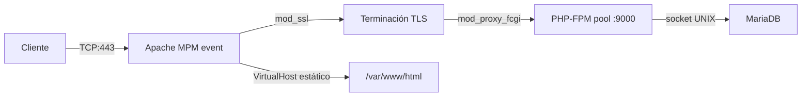

# UD2: Servidores Web Clásicos: Apache HTTP Server

!!! info "Ficha Técnica y Alcance de la Unidad"
    * **Carga Lectiva:** 4 horas presenciales
    * **Resultados de Aprendizaje:** RA1 (criterios d, e, f)
    * **Tecnologías Involucradas:** [Apache HTTP Server](tech/apache.md), PHP-FPM (se detalla en UD4, no incluida en este repositorio)
    * **Referencias y Estándares:** CIS Apache HTTP Server Benchmark, CCN-STIC-599A20, OWASP ASVS

---

## 📖 1. Fundamentos Teóricos y Arquitectura

### 1.1 ¿Qué es exactamente un "servidor web"?

En UD1 vimos que el servidor es el programa que escucha peticiones HTTP y responde. **Apache HTTP
Server** (mantenido por la Apache Software Foundation, de ahí "ASF") es uno de los programas más
usados del mundo para cumplir ese papel. Cuando lo instalamos, se convierte en un **servicio** del
sistema operativo: un programa que arranca junto al sistema y permanece en ejecución en segundo
plano, sin que nadie tenga que "abrirlo" manualmente (como sí haríamos con un editor de texto). Quien
gestiona ese arranque automático en Debian/Ubuntu es **systemd**, el sistema de inicio: es el mismo
mecanismo que arrancará PHP-FPM en UD4, Nginx en UD3 o cualquier otro servicio del módulo — conviene
familiarizarse con sus comandos ahora porque se repetirán constantemente el resto del curso.

Puedes comprobar que un servicio está en marcha con `systemctl status apache2`; lo arrancamos,
paramos o reiniciamos con `systemctl start|stop|restart apache2`.

### 1.2 Contenido estático vs. contenido dinámico

Antes de hablar de cómo Apache gestiona la concurrencia, hay que distinguir dos tipos de contenido
que un servidor puede servir:

- **Estático:** el fichero que se envía es exactamente el que hay guardado en el disco (una imagen
  `.jpg`, un `.html` fijo). El servidor solo tiene que "leer y enviar", sin procesar nada.
- **Dinámico:** el contenido se genera en el momento, ejecutando código (por ejemplo, un script PHP
  que consulta una base de datos y construye el HTML al vuelo, antes de enviarlo). Esto es mucho más
  costoso en CPU que servir un fichero estático, y es la razón por la que existen mecanismos
  específicos (como PHP-FPM, que veremos en este UD) para gestionar ese procesamiento de forma
  eficiente y separada del propio servidor web.

### 1.3 ¿Cómo atiende Apache a varios usuarios a la vez? Procesos, hilos y MPM

Si dos personas piden una página al mismo tiempo, el servidor tiene que poder atenderlas a las dos sin
que una tenga que esperar a que termine la otra. Para entender cómo lo resuelve Apache, conviene fijar
dos conceptos básicos de sistemas operativos:

- **Proceso:** una copia en ejecución de un programa, con su propia memoria reservada, totalmente
  aislada de otros procesos. Crear un proceso nuevo tiene cierto coste (tiempo y memoria).
- **Hilo (thread):** una "sub-tarea" dentro de un mismo proceso, que comparte memoria con los demás
  hilos de ese proceso. Crear un hilo es más barato que crear un proceso completo, pero al compartir
  memoria hay que tener cuidado con el código que no está preparado para ejecutarse en paralelo sin
  interferencias (código *no thread-safe*).

Apache permite elegir cómo organiza esta concurrencia mediante un **MPM** (*Multi-Processing
Module*), y hay tres modelos disponibles:

| MPM | Cómo atiende conexiones | Cuándo usarlo |
|---|---|---|
| **prefork** | Un proceso completo por cada conexión | Compatible con módulos antiguos no *thread-safe* como `mod_php` clásico |
| **worker** | Procesos con varios hilos cada uno | Más eficiente en memoria que prefork |
| **event** | Variante de worker que además delega la gestión de conexiones inactivas (*keep-alive*) a hilos dedicados | Recomendado en producción moderna, especialmente junto a PHP-FPM externo |





En despliegues modernos con PHP-FPM se recomienda **event + mod_proxy_fcgi**: Apache (rápido y
ligero, gestionando muchas conexiones simultáneas) delega la parte pesada — ejecutar PHP — a un
programa externo especializado (PHP-FPM), que se estudiará con más detalle en UD4. Esta separación de
responsabilidades es un patrón muy habitual en arquitecturas de servidores.

### 1.4 ¿Dónde vive la configuración de Apache?

Antes de tocar ningún fichero conviene tener el mapa completo — si no, cada ruta nueva que aparezca
parecerá sacada de la nada. En Debian/Ubuntu, Apache organiza su configuración así:

| Ruta | Contenido |
|---|---|
| `/etc/apache2/apache2.conf` | Fichero principal: carga todo lo demás mediante directivas `Include` |
| `/etc/apache2/ports.conf` | En qué puertos escucha Apache (`Listen 80`, `Listen 443`) |
| `/etc/apache2/sites-available/` | **Borrador** de cada VirtualHost — puede haber muchos, estén activos o no |
| `/etc/apache2/sites-enabled/` | Solo los VirtualHosts **activos**: son enlaces simbólicos a ficheros de `sites-available/` |
| `/etc/apache2/mods-available/` y `mods-enabled/` | Igual que los sitios, pero para módulos |
| `/var/www/` | Carpeta por defecto donde vive el contenido de los sitios (el `DocumentRoot`) |
| `/var/log/apache2/` | Registro de actividad y errores |

La separación *available* vs. *enabled* es el mismo patrón en sitios y en módulos: tener un fichero en
`sites-available` no activa nada por sí solo, es solo un borrador guardado; hace falta "encenderlo"
explícitamente (con `a2ensite`, que veremos en el laboratorio) para que Apache lo cargue.

### 1.5 ¿Qué es un VirtualHost?

Un mismo servidor físico (o virtual) puede alojar **varios sitios web distintos** a la vez, cada uno
con su propio dominio, sus propios ficheros y su propia configuración. Cada uno de esos sitios se
define en Apache como un **VirtualHost**: un bloque de configuración que le dice a Apache "cuando
llegue una petición para *este* dominio, sírvela desde *esta* carpeta, con *esta* configuración de
TLS". Sin VirtualHosts, cada dominio necesitaría su propia máquina física — algo enormemente
ineficiente si el tráfico de cada sitio es moderado.

### 1.6 Con varios VirtualHosts en el mismo puerto, ¿cómo sabe Apache cuál usar?

Esto suele ser el punto que menos se entiende a la primera, así que vale la pena pararse: si `app.iaw.local`
y `otroweb.local` comparten la misma IP y el mismo puerto 443, ¿cómo distingue Apache qué VirtualHost
debe atender cada petición? La respuesta conecta directamente con algo que ya vimos en UD1:

- **Sin cifrar (HTTP):** Apache lee la cabecera `Host:` que el navegador envía en la propia petición
  (la misma que vimos en el ejemplo de UD1 — `Host: app.iaw.local`) y la compara con el `ServerName`
  de cada VirtualHost disponible.
- **Cifrado (HTTPS):** el problema es que, en teoría, hace falta saber *qué certificado* enviar antes
  incluso de que la petición HTTP (con su cabecera `Host`) llegue a viajar cifrada. Esto se resuelve
  con **SNI** (*Server Name Indication*): el navegador indica el dominio deseado, en claro, como parte
  del propio saludo inicial de TLS, antes de que empiece el cifrado — así Apache ya sabe qué
  certificado y qué VirtualHost usar desde el primer momento.

Si ningún `ServerName` coincide, Apache usa el **primer VirtualHost definido** como respuesta por
defecto — por eso el orden en que se activan los sitios importa, y por eso es buena práctica tener
siempre un VirtualHost "por defecto" explícito y controlado.

## ⚙️ 2. Instalación, Configuración Avanzada y Hardening

```bash title="Instalación Apache + PHP-FPM en Debian/Ubuntu Server" linenums="1"
apt install -y apache2 php8.3-fpm libapache2-mod-fcgid
a2enmod proxy proxy_fcgi setenvif rewrite ssl headers
a2dismod mpm_prefork
a2enmod mpm_event
systemctl restart apache2
```

`a2enmod`/`a2dismod` (*Apache 2 enable/disable module*) activan o desactivan **módulos**: piezas de
funcionalidad opcional que se pueden añadir a Apache sin recompilarlo (aquí activamos el proxy hacia
FastCGI, la reescritura de URLs, TLS y la gestión de cabeceras HTTP). Usamos `systemctl restart` (no
`reload`) porque cambiar el MPM activo es un cambio estructural del propio proceso maestro de Apache,
no una simple recarga de configuración — `reload` no basta aquí.

!!! example "Laboratorio / Despliegue Real"
    Antes de complicar nada con TLS o PHP, comprueba que la instalación por defecto ya funciona:
    `curl -I http://localhost/` debería devolver `200 OK` y servir la página de bienvenida de Apache
    (`/var/www/html/index.html`, creada automáticamente por el paquete). Si esto falla, ningún paso
    posterior va a funcionar — resuelve esto primero.

Ahora sí, preparamos la carpeta de nuestro propio sitio (el `DocumentRoot` que usará el VirtualHost):

```bash title="Crear el DocumentRoot del sitio" linenums="1"
mkdir -p /var/www/app
echo "<h1>Funciona: app.iaw.local</h1>" > /var/www/app/index.html
chown -R www-data:www-data /var/www/app
```

`chown www-data:www-data` asigna la carpeta al usuario con el que **realmente** se ejecuta Apache (no
root, por seguridad — principio de mínimo privilegio): así el proceso puede leer esos ficheros sin
necesitar permisos de administrador.

```apache title="/etc/apache2/sites-available/app-segura.conf" linenums="1"
<VirtualHost *:443>
    ServerName app.iaw.local
    DocumentRoot /var/www/app

    SSLEngine on
    SSLCertificateFile /etc/ssl/lab/lab.crt
    SSLCertificateKeyFile /etc/ssl/lab/lab.key
    SSLProtocol -all +TLSv1.3 +TLSv1.2
    SSLCipherSuite HIGH:!aNULL:!MD5:!3DES

    <FilesMatch "\.php$">
        SetHandler "proxy:unix:/run/php/php8.3-fpm.sock|fcgi://localhost"
    </FilesMatch>

    Header always set Strict-Transport-Security "max-age=63072000; includeSubDomains"
    Header always set X-Content-Type-Options "nosniff"
    Header unset X-Powered-By

    ErrorLog ${APACHE_LOG_DIR}/app_error.log
    CustomLog ${APACHE_LOG_DIR}/app_access.log combined
</VirtualHost>
```

Explicación línea a línea de lo esencial: `ServerName` es precisamente el valor que Apache compara
contra la cabecera `Host`/SNI del apartado 1.6 para elegir este bloque; `DocumentRoot` es la carpeta
que acabamos de crear; `SSLCertificateFile`/`SSLCertificateKeyFile` cargan el certificado y clave
generados en UD1; y `<FilesMatch "\.php$">` indica que **cualquier fichero que termine en `.php`**
debe procesarse de forma especial (no enviarse tal cual, sino ejecutarse) — ahí es donde entra
PHP-FPM.

`SetHandler proxy:unix:...fcgi://localhost` conecta Apache al *socket* UNIX de PHP-FPM: evita el coste
de un socket TCP local y aísla el intérprete PHP en un proceso con su propio usuario/grupo (`www-data`
o dedicado), cumpliendo el principio de mínimo privilegio de CIS Benchmark 3.x.

!!! danger "Seguridad y Hardening (CIS / CCN-CERT / OWASP)"
    `Header unset X-Powered-By` y `ServerTokens Prod` / `ServerSignature Off` en `/etc/apache2/conf-enabled/security.conf`
    evitan fuga de versión exacta del *stack* (CIS 3.1, CCN-STIC-599A20 §4.2).

## 🛠️ 3. Laboratorio Práctico Dirigido

```bash title="Activar sitio, validar sintaxis y recargar" linenums="1"
a2ensite app-segura.conf
apachectl configtest
systemctl reload apache2
curl -I https://app.iaw.local/
```

```text title="Salida esperada del último comando"
HTTP/2 200
date: ...
server: Apache
strict-transport-security: max-age=63072000; includeSubDomains
content-type: text/html
```

`a2ensite` activa el VirtualHost (crea un enlace simbólico desde `sites-available` a `sites-enabled`,
justo el patrón del apartado 1.4); `apachectl configtest` es un paso que **nunca debe omitirse**:
valida la sintaxis del fichero antes de recargar, evitando dejar el servidor caído por un error
tipográfico en producción. Aquí sí usamos `reload` en vez de `restart`: solo estamos añadiendo un
VirtualHost nuevo, no cambiando el MPM, así que Apache puede releer su configuración sin cortar las
conexiones que ya estuvieran activas — la misma distinción volverá a aparecer en UD3 con Nginx.

```bash title="Verificación de que PHP no se ejecuta con mod_php residual" linenums="1"
apache2ctl -M | grep -i php   # No debe listar php_module
systemctl status php8.3-fpm
```

## 🛡️ 4. Seguridad, Logs y Optimización de Rendimiento

* Logs: `/var/log/apache2/app_error.log` y `app_access.log` (formato `combined`). Revisar estos
  ficheros es el primer paso ante cualquier incidencia — casi siempre explican qué ha fallado y por qué.
* Ajuste de MPM event en `/etc/apache2/mods-available/mpm_event.conf`: `MaxRequestWorkers` debe
  dimensionarse según `RAM disponible / tamaño medio de proceso hijo`, evitando *swapping* bajo carga.
* `mod_status` (`/server-status`, restringido por IP) permite monitorizar *workers* activos en tiempo real.

!!! warning "Rendimiento y Cuellos de Botella"
    Con PHP-FPM externo, `pm.max_children` del *pool* (no `MaxRequestWorkers` de Apache) es el límite
    real de concurrencia de PHP; dimensionar ambos de forma descoordinada genera 502/504 bajo carga.

## ❓ 5. Preguntas y Casos de Autoevaluación

1. **¿Por qué no se puede combinar MPM `event` con `mod_php` clásico?**
   *Resolución:* `mod_php` no es *thread-safe*; MPM event usa hilos para gestionar conexiones keep-alive,
   lo que provocaría condiciones de carrera. Solución: PHP-FPM vía `mod_proxy_fcgi` (proceso separado).

2. **El sitio devuelve 502 Bad Gateway de forma intermitente. ¿Qué dos parámetros revisar primero?**
   *Resolución:* `pm.max_children` en el *pool* PHP-FPM (saturación) y `request_terminate_timeout`;
   también el *socket* `listen.backlog` si hay picos de conexión.

3. **¿Qué riesgo mitiga `Header unset X-Powered-By` y `ServerTokens Prod`?**
   *Resolución:* Reduce *fingerprinting* de versión exacta que facilitaría explotar CVEs conocidas
   de esa versión concreta (OWASP: *Information Exposure*, CWE-200).

4. **Diferencia entre `SetHandler` con socket UNIX y `ProxyPass` con `fcgi://127.0.0.1:9000`.**
   *Resolución:* El socket UNIX evita la pila TCP/IP local (menor latencia, sin puerto expuesto);
   TCP es necesario solo si PHP-FPM corre en otro host/contenedor.

5. **¿Por qué se recomienda TLS 1.3+1.2 y no dejar `SSLProtocol all`?**
   *Resolución:* `all` incluiría SSLv3/TLS1.0/1.1, protocolos con vulnerabilidades conocidas
   (POODLE, BEAST) y no conformes con CCN-STIC ni PCI-DSS 4.0.

6. **Tienes dos VirtualHosts en el puerto 443 y ninguno tiene el `ServerName` que pide el cliente. ¿Qué VirtualHost responde?**
   *Resolución:* El **primero definido** en el orden de carga de Apache (normalmente, el primer
   fichero activado alfabéticamente en `sites-enabled/`) — de ahí la importancia de tener siempre un
   VirtualHost por defecto explícito y controlado.

7. **Acabas de ejecutar `a2ensite` sobre un VirtualHost nuevo. ¿Con `reload` es suficiente, o hace falta `restart`?**
   *Resolución:* Con `reload` basta: añadir un VirtualHost es releer configuración, no cambiar el
   MPM ni otros parámetros estructurales del proceso maestro; `restart` solo es necesario para esos
   cambios estructurales (como el cambio de MPM hecho en la instalación).