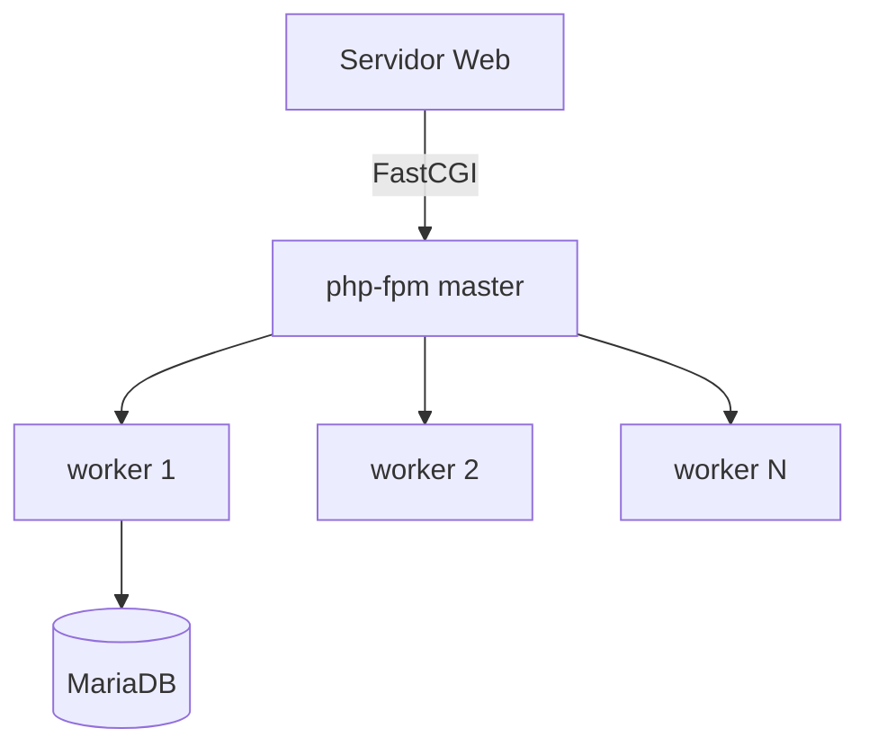

# UD4: Lenguajes de Servidor: Entorno PHP

!!! info "Ficha Técnica y Alcance de la Unidad"
    * **Carga Lectiva:** 6 horas presenciales
    * **Resultados de Aprendizaje:** RA5 (criterios a, b, c, d, e)
    * **Tecnologías Involucradas:** [PHP-FPM](tech/php-fpm.md), [MariaDB](tech/mariadb.md)
    * **Referencias y Estándares:** PHP-FPM Manual (php.net), PSR-12 (PHP-FIG), OWASP Input Validation Cheat Sheet

---

## 📖 1. Fundamentos Teóricos y Arquitectura

PHP es un lenguaje de guiones interpretado, ejecutado en el servidor como *Server-Side Includes*: el
intérprete procesa el código entre `<?php ?>` y devuelve HTML/JSON puro al cliente, que nunca ve el
código fuente. **PHP-FPM** (*FastCGI Process Manager*) gestiona un *pool* de procesos *worker*
persistentes, evitando el arranque de un intérprete nuevo por petición (modelo CGI clásico, obsoleto).



La sintaxis básica cubre tipos escalares (`int`, `float`, `string`, `bool`), compuestos (`array`,
`object`), estructuras de control (`if/elseif`, `switch`, `match` desde PHP 8), bucles (`for`,
`foreach`, `while`) y funciones con *type hinting* estricto (`declare(strict_types=1)`), obligatorio
en código profesional para evitar coerciones de tipo implícitas y errores de lógica silenciosos.

## ⚙️ 2. Instalación, Configuración Avanzada y Hardening

```bash title="Instalación PHP 8.3 + extensiones habituales" linenums="1"
apt install -y php8.3-fpm php8.3-mysql php8.3-mbstring php8.3-xml php8.3-curl php8.3-opcache
systemctl enable --now php8.3-fpm
```

```ini title="/etc/php/8.3/fpm/pool.d/www.conf" linenums="1"
[www]
user = www-data
group = www-data
listen = /run/php/php8.3-fpm.sock
listen.owner = www-data
listen.group = www-data
pm = dynamic
pm.max_children = 20
pm.start_servers = 4
pm.min_spare_servers = 2
pm.max_spare_servers = 6
pm.max_requests = 500
```

`pm.max_requests = 500` recicla cada *worker* tras 500 peticiones: mitiga fugas de memoria acumuladas
en extensiones C mal liberadas, práctica estándar en producción PHP-FPM.

!!! danger "Seguridad y Hardening (CIS / CCN-CERT / OWASP)"
    En `/etc/php/8.3/fpm/php.ini`: `expose_php = Off` (oculta versión en cabecera `X-Powered-By`),
    `display_errors = Off` en producción (evita fuga de rutas del sistema en *stack traces*),
    `disable_functions = exec,shell_exec,system,passthru` si la aplicación no requiere ejecución de shell.

## 🛠️ 3. Laboratorio Práctico Dirigido

```php title="/var/www/app/formulario.php — validación con filter_var" linenums="1"
<?php
declare(strict_types=1);

function validarEmail(string $email): ?string {
    $limpio = filter_var(trim($email), FILTER_SANITIZE_EMAIL);
    return filter_var($limpio, FILTER_VALIDATE_EMAIL) ? $limpio : null;
}

if ($_SERVER['REQUEST_METHOD'] === 'POST') {
    $email = validarEmail($_POST['email'] ?? '');
    if ($email === null) {
        http_response_code(422);
        exit(json_encode(['error' => 'Email inválido']));
    }
    echo json_encode(['ok' => true, 'email' => $email]);
}
```

```bash title="Prueba funcional con curl" linenums="1"
curl -X POST https://app.iaw.local/formulario.php -d "email=alumno@iaw.local"
systemctl status php8.3-fpm --no-pager
```

## 🛡️ 4. Seguridad, Logs y Optimización de Rendimiento

* Logs de proceso: `/var/log/php8.3-fpm.log`; *slow log* (`slowlog` + `request_slowlog_timeout`) para
  detectar scripts con tiempos de ejecución anómalos.
* **OPcache** (`opcache.enable=1`, `opcache.validate_timestamps=0` en producción con *deploy* controlado)
  cachea el *bytecode* compilado evitando reparsear PHP en cada petición: mejora crítica de rendimiento.
* Gestión de errores: `set_error_handler()` y `try/catch` sobre excepciones (`\Throwable`) en vez de
  suprimir errores con `@`, que oculta fallos reales sin registrarlos.

## ❓ 5. Preguntas y Casos de Autoevaluación

1. **¿Por qué PHP-FPM es preferible a `mod_php` en arquitecturas con Nginx?**
   *Resolución:* Nginx no ejecuta módulos de proceso embebidos (arquitectura basada en eventos); PHP-FPM
   se comunica vía protocolo FastCGI independiente del servidor web, siendo compatible con ambos.

2. **Un formulario permite inyectar `<script>` en el campo nombre. ¿Qué falta?**
   *Resolución:* Sanitización de salida (`htmlspecialchars()` al imprimir, no solo validación de
   entrada) — prevención de XSS almacenado según OWASP Cross-Site Scripting Cheat Sheet.

3. **¿Qué efecto tiene `pm.max_children` demasiado bajo bajo carga real?**
   *Resolución:* Las peticiones que exceden el límite quedan en la cola de `listen.backlog` y expiran,
   generando 502/504 en el proxy frontal aunque la CPU del servidor esté ociosa.

4. **Explica la diferencia entre `==` y `===` en PHP y su relevancia en seguridad.**
   *Resolución:* `==` realiza coerción de tipos (`"0e123" == "0e456"` es `true`, vulnerabilidad conocida
   en comparación de hashes tipo "magic hash"); `===` compara tipo y valor, obligatorio en comparaciones
   de credenciales o tokens.

5. **¿Por qué `opcache.validate_timestamps=0` es peligroso en un entorno de desarrollo activo?**
   *Resolución:* OPcache no detecta cambios en los ficheros fuente y sirve *bytecode* obsoleto; solo
   es seguro en producción con *pipeline* de despliegue que reinicie PHP-FPM tras cada `deploy`.
