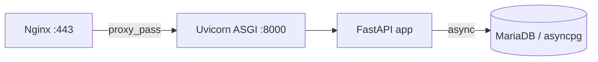

# UD5: Scripting Moderno Backend: Python

!!! info "Ficha Técnica y Alcance de la Unidad"
    * **Carga Lectiva:** 6 horas presenciales
    * **Resultados de Aprendizaje:** RA5 (criterios f, g, h, i)
    * **Tecnologías Involucradas:** [Python (Flask/FastAPI)](tech/python.md)
    * **Referencias y Estándares:** PEP 3333 (WSGI), ASGI Spec, RFC 6265 (Cookies), OWASP Session Management Cheat Sheet

---

## 📖 1. Fundamentos Teóricos y Arquitectura

Python en entorno web se ejecuta mediante interfaces estándar: **WSGI** (PEP 3333, síncrono, servido por
Gunicorn) para Flask, y **ASGI** (asíncrono, servido por Uvicorn) para FastAPI, permitiendo *WebSockets*
y concurrencia real vía `async`/`await`. A diferencia de PHP-FPM, el propio proceso Python mantiene el
*runtime* completo cargado en memoria entre peticiones.



**Formularios** se procesan con `request.form` (Flask) o modelos `Pydantic` (FastAPI, con validación
automática de tipos declarados). La **persistencia entre documentos** se resuelve con sesiones firmadas
(cookie de sesión conforme a RFC 6265) o JWT sin estado en el servidor.

## ⚙️ 2. Instalación, Configuración Avanzada y Hardening

```bash title="Entorno virtual y dependencias" linenums="1"
apt install -y python3.12-venv
python3 -m venv /opt/app/venv
source /opt/app/venv/bin/activate
pip install fastapi "uvicorn[standard]" python-multipart itsdangerous
```

```python title="/opt/app/main.py — API con autenticación de sesión" linenums="1"
from fastapi import FastAPI, Request, HTTPException
from itsdangerous import URLSafeTimedSerializer

app = FastAPI()
serializer = URLSafeTimedSerializer(secret_key="CAMBIAR_EN_PRODUCCION_32B")

@app.post("/login")
async def login(request: Request):
    form = await request.form()
    if form.get("password") != "demo":
        raise HTTPException(status_code=401, detail="Credenciales inválidas")
    token = serializer.dumps({"user": form.get("user")})
    return {"session": token}

@app.get("/protegido")
async def protegido(session: str):
    try:
        datos = serializer.loads(session, max_age=3600)  # expira a la hora
    except Exception:
        raise HTTPException(status_code=401, detail="Sesión inválida o caducada")
    return {"usuario_aislado": datos["user"]}
```

```ini title="/etc/systemd/system/app-uvicorn.service" linenums="1"
[Unit]
Description=Uvicorn ASGI para app FastAPI
After=network.target

[Service]
User=www-data
WorkingDirectory=/opt/app
ExecStart=/opt/app/venv/bin/uvicorn main:app --host 127.0.0.1 --port 8000 --workers 4
Restart=always

[Install]
WantedBy=multi-user.target
```

!!! danger "Seguridad y Hardening (CIS / CCN-CERT / OWASP)"
    El `secret_key` de firma de sesión debe cargarse desde variable de entorno (`os.environ`), nunca
    hardcodeado; rotar la clave invalida todas las sesiones activas — política a documentar.

## 🛠️ 3. Laboratorio Práctico Dirigido

```bash title="Arranque del servicio y prueba de aislamiento de sesión" linenums="1"
systemctl daemon-reload && systemctl enable --now app-uvicorn
TOKEN=$(curl -s -X POST http://127.0.0.1:8000/login -d "user=alumno&password=demo" | jq -r .session)
curl -s "http://127.0.0.1:8000/protegido?session=$TOKEN"
curl -s "http://127.0.0.1:8000/protegido?session=token_falso"   # Debe devolver 401
```

## 🛡️ 4. Seguridad, Logs y Optimización de Rendimiento

* Uvicorn registra en *stdout*, capturado por `journalctl -u app-uvicorn -f` bajo systemd.
* `--workers 4` en Uvicorn reparte carga entre procesos (GIL de Python limita paralelismo por proceso;
  el paralelismo real se logra con múltiples procesos, no hilos, para CPU-bound).
* `itsdangerous.URLSafeTimedSerializer` firma con HMAC y expira por tiempo: aísla el entorno de cada
  usuario sin estado compartido en servidor (escalable horizontalmente sin *sticky sessions*).

## ❓ 5. Preguntas y Casos de Autoevaluación

1. **¿Por qué FastAPI requiere un servidor ASGI (Uvicorn) y no puede correr en Apache `mod_wsgi`?**
   *Resolución:* `mod_wsgi` implementa la interfaz WSGI síncrona; FastAPI es *async-first* (ASGI),
   incompatible con WSGI salvo adaptadores que anulan las ventajas de concurrencia asíncrona.

2. **Un usuario reutiliza el token de sesión de otro tras cerrar sesión. ¿Qué falta en el diseño?**
   *Resolución:* Falta invalidación server-side (lista de revocación o `jti` con TTL en caché) o
   comprobación de expiración; los JWT/tokens firmados sin estado no se pueden "cerrar" por sí solos.

3. **¿Qué garantiza `max_age=3600` en `serializer.loads()`?**
   *Resolución:* Verifica la marca de tiempo embebida en el token firmado y lo rechaza si supera
   3600s desde su emisión, aunque la firma HMAC siga siendo válida — expiración temporal explícita.

4. **Diferencia entre `request.form` (Flask, síncrono) y `await request.form()` (FastAPI, asíncrono).**
   *Resolución:* En FastAPI la lectura del cuerpo de la petición es una operación de I/O no bloqueante;
   con `await` el *event loop* atiende otras peticiones mientras se completa la lectura del socket.

5. **¿Por qué no se debe generar el `secret_key` en cada arranque del servicio?**
   *Resolución:* Invalidaría todas las sesiones activas en cada *restart*/despliegue; debe persistir
   en configuración/secreto externo (variable de entorno, vault) y rotarse de forma controlada.
