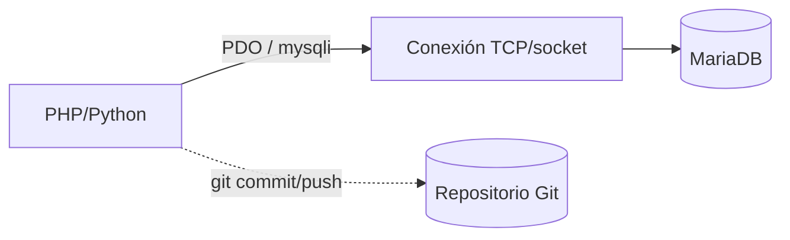

# UD6: Bases de Datos Web y Control de Versiones

!!! info "Ficha Técnica y Alcance de la Unidad"
    * **Carga Lectiva:** 5 horas presenciales
    * **Resultados de Aprendizaje:** RA6 (criterios a, b, c, d)
    * **Tecnologías Involucradas:** [MariaDB](tech/mariadb.md), [Git](tech/git.md)
    * **Referencias y Estándares:** MariaDB Knowledge Base, Git Pro Book (Scott Chacon), OWASP SQL Injection Prevention Cheat Sheet

---

## 📖 1. Fundamentos Teóricos y Arquitectura

La integración entre lenguaje de guiones y SGBD se realiza mediante **drivers/extensiones nativas**
(`mysqli`/`PDO` en PHP, `mysql-connector-python`/`SQLAlchemy` en Python) que abren una conexión —
idealmente vía **consultas preparadas** (*prepared statements*), separando la plantilla SQL de los
datos del usuario y eliminando estructuralmente la inyección SQL (OWASP Top 10 #A03).



**Git** no forma parte del currículo de RA6, pero es la herramienta transversal que garantiza
trazabilidad de cambios en esquemas (`migrations/`) y código de acceso a datos — buena práctica DevOps
exigida en cualquier entorno de producción real.

## ⚙️ 2. Instalación, Configuración Avanzada y Hardening

```bash title="Instalación MariaDB y hardening inicial" linenums="1"
apt install -y mariadb-server git
mysql_secure_installation   # elimina usuarios anónimos, deshabilita root remoto, elimina BD test
```

```sql title="Creación de BD, tabla y usuario de aplicación con mínimo privilegio" linenums="1"
CREATE DATABASE app_iaw CHARACTER SET utf8mb4 COLLATE utf8mb4_unicode_ci;

CREATE TABLE app_iaw.usuarios (
    id INT AUTO_INCREMENT PRIMARY KEY,
    email VARCHAR(255) NOT NULL UNIQUE,
    creado_en TIMESTAMP DEFAULT CURRENT_TIMESTAMP
);

CREATE USER 'app_user'@'localhost' IDENTIFIED BY 'CAMBIAR_POR_SECRETO_FUERTE';
GRANT SELECT, INSERT, UPDATE, DELETE ON app_iaw.* TO 'app_user'@'localhost';
FLUSH PRIVILEGES;
```

```php title="Conexión PDO con consulta preparada (previene inyección SQL)" linenums="1"
<?php
$pdo = new PDO('mysql:host=localhost;dbname=app_iaw;charset=utf8mb4', 'app_user', getenv('DB_PASS'), [
    PDO::ATTR_ERRMODE => PDO::ERRMODE_EXCEPTION,
]);
$stmt = $pdo->prepare('SELECT id, email FROM usuarios WHERE email = :email');
$stmt->execute(['email' => $_POST['email']]);
$usuario = $stmt->fetch(PDO::FETCH_ASSOC);
```

!!! danger "Seguridad y Hardening (CIS / CCN-CERT / OWASP)"
    Nunca concatenar `$_POST` directamente en SQL. `app_user` nunca debe tener privilegios `DROP`,
    `GRANT` ni `FILE` — principio de mínimo privilegio (CIS MariaDB Benchmark §4).

## 🛠️ 3. Laboratorio Práctico Dirigido

```bash title="Inicializar repositorio Git con flujo de trabajo estándar" linenums="1"
cd /opt/app
git init
cat > .gitignore << 'EOF'
venv/
.env
*.log
EOF
git add . && git commit -m "feat: estructura inicial del proyecto y esquema de BD"
git branch -M main
git remote add origin git@github.com:instituto/app-iaw.git
git push -u origin main
```

```bash title="Verificación de conexión desde el intérprete" linenums="1"
mysql -u app_user -p -e "SELECT VERSION(); SHOW TABLES FROM app_iaw;"
```

## 🛡️ 4. Seguridad, Logs y Optimización de Rendimiento

* `slow_query_log = ON` y `long_query_time = 1` en `/etc/mysql/mariadb.conf.d/50-server.cnf` para
  detectar consultas ineficientes (`EXPLAIN` sobre las detectadas).
* Índices sobre columnas usadas en `WHERE`/`JOIN` (aquí `email UNIQUE` ya crea índice implícito).
* Git: convención **Conventional Commits** (`feat:`, `fix:`, `chore:`) para generar *changelogs*
  automáticos y facilitar *bisect* ante regresiones.

## ❓ 5. Preguntas y Casos de Autoevaluación

1. **¿Por qué una consulta preparada previene inyección SQL aunque el input contenga `' OR '1'='1`?**
   *Resolución:* El *placeholder* (`:email`) se envía por separado del SQL ya compilado; el motor lo
   trata siempre como dato literal, nunca como sintaxis SQL ejecutable.

2. **¿Qué diferencia hay entre `GRANT ALL` y los privilegios otorgados en el laboratorio?**
   *Resolución:* `GRANT ALL` incluiría `DROP`/`ALTER`/`GRANT`, permitiendo a un atacante que comprometa
   la app destruir o escalar privilegios; el mínimo privilegio limita el daño ante una vulnerabilidad.

3. **Un `git push` es rechazado con `non-fast-forward`. ¿Qué acción es correcta?**
   *Resolución:* `git pull --rebase origin main` para reaplicar los commits locales sobre el historial
   remoto actualizado, evitando un merge commit innecesario, y luego reintentar el `push`.

4. **¿Por qué versionar `.env` en Git es una mala práctica de seguridad?**
   *Resolución:* Expondría credenciales (contraseñas de BD, claves API) en el historial del repositorio,
   recuperables incluso tras eliminarlas de un commit posterior; deben ir en `.gitignore`.

5. **Explica el propósito de `slow_query_log` en un entorno de producción.**
   *Resolución:* Registra consultas que superan `long_query_time` segundos, permitiendo identificar
   cuellos de botella (falta de índices, `JOIN`s mal optimizados) antes de que degraden el servicio.
