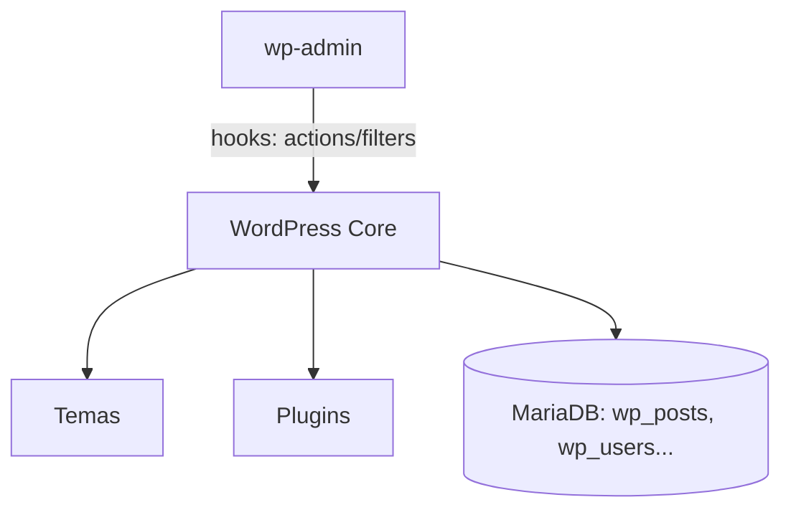

# UD7: Gestores de Contenidos: WordPress Core

!!! info "Ficha Técnica y Alcance de la Unidad"
    * **Carga Lectiva:** 5 horas presenciales
    * **Resultados de Aprendizaje:** RA2 (criterios a, b, c, d, e, f)
    * **Tecnologías Involucradas:** [WordPress](tech/wordpress.md), [MariaDB](tech/mariadb.md)
    * **Referencias y Estándares:** WordPress Developer Handbook, OWASP Top 10, CIS Benchmark genérico de hardening web

---

## 📖 1. Fundamentos Teóricos y Arquitectura

Un CMS (*Content Management System*) separa la gestión de contenido (editores no técnicos) de la
presentación (temas) y la lógica (plugins), sobre un núcleo común. WordPress representa ~40% de la web
mundial; su arquitectura es LAMP/LEMP clásica: PHP + MySQL/MariaDB, con un sistema de *hooks*
(`actions`/`filters`) que permite extender el núcleo sin modificarlo directamente.



Se clasifican por funcionalidad principal: **blog/portal** (WordPress, Ghost), **e-commerce**
(WooCommerce sobre WP, PrestaShop), **e-learning** (Moodle) y **wiki** (MediaWiki). La elección depende
de licencia (GPL en WordPress core), requisitos de funcionamiento y comunidad de soporte.

## ⚙️ 2. Instalación, Configuración Avanzada y Hardening

```bash title="Preparación de BD dedicada" linenums="1"
mysql -u root -p << 'SQL'
CREATE DATABASE wordpress CHARACTER SET utf8mb4 COLLATE utf8mb4_unicode_ci;
CREATE USER 'wp_user'@'localhost' IDENTIFIED BY 'SECRETO_FUERTE_UNICO';
GRANT ALL PRIVILEGES ON wordpress.* TO 'wp_user'@'localhost';
FLUSH PRIVILEGES;
SQL
```

```bash title="Descarga verificada e instalación de WordPress" linenums="1"
cd /var/www
curl -O https://wordpress.org/latest.tar.gz
curl -O https://wordpress.org/latest.tar.gz.sha1
sha1sum -c <(echo "$(cat latest.tar.gz.sha1)  latest.tar.gz")   # verificación de integridad
tar xzf latest.tar.gz
chown -R www-data:www-data wordpress
find wordpress -type d -exec chmod 750 {} \;
find wordpress -type f -exec chmod 640 {} \;
```

```php title="wp-config.php — claves de seguridad y salts" linenums="1"
define('DB_NAME', 'wordpress');
define('DB_USER', 'wp_user');
define('DB_PASSWORD', getenv('WP_DB_PASS'));
define('DB_HOST', 'localhost');
// Generar únicas en https://api.wordpress.org/secret-key/1.1/salt/
define('AUTH_KEY', '...'); define('SECURE_AUTH_KEY', '...');
define('DISALLOW_FILE_EDIT', true);   // impide editar plugins/temas desde wp-admin
define('WP_DEBUG', false);
```

!!! danger "Seguridad y Hardening (CIS / CCN-CERT / OWASP)"
    `chmod 640` (no 644) en ficheros y **prefijo de tabla no estándar** (`table_prefix = 'wpXY_'` en
    vez de `wp_`) dificultan ataques automatizados de inyección SQL genéricos contra el esquema por defecto.

## 🛠️ 3. Laboratorio Práctico Dirigido

```bash title="Finalización de instalación vía WP-CLI (evita el wizard web)" linenums="1"
curl -O https://raw.githubusercontent.com/wp-cli/builds/gh-pages/phar/wp-cli.phar
chmod +x wp-cli.phar && mv wp-cli.phar /usr/local/bin/wp

cd /var/www/wordpress
sudo -u www-data wp core install \
  --url="https://app.iaw.local" \
  --title="Portal IAW" \
  --admin_user="admin_iaw" \
  --admin_password="$(openssl rand -base64 16)" \
  --admin_email="admin@iaw.local"
```

## 🛡️ 4. Seguridad, Logs y Optimización de Rendimiento

* Logs de aplicación: `WP_DEBUG_LOG` escribe en `wp-content/debug.log` (activar solo en staging).
* Bloquear acceso directo a `wp-config.php` y `xmlrpc.php` (vector histórico de *brute-force*
  amplificado) desde la configuración del servidor web (UD2/UD3).
* Actualizaciones automáticas de núcleo menor (`WP_AUTO_UPDATE_CORE = 'minor'`) reducen la ventana
  de exposición ante CVEs conocidas sin riesgo de romper compatibilidad mayor.

## ❓ 5. Preguntas y Casos de Autoevaluación

1. **¿Por qué se recomienda cambiar el prefijo de tabla por defecto `wp_`?**
   *Resolución:* Dificulta ataques de inyección SQL genéricos que asumen nombres de tabla estándar
   (`wp_users`); es una medida de *defense in depth*, no sustituye consultas preparadas del core.

2. **`wp-config.php` con `DB_PASSWORD` en texto plano versionado en Git. ¿Riesgo y solución?**
   *Resolución:* Exposición de credenciales en el historial; usar variables de entorno (`getenv()`)
   y excluir el fichero real de Git, versionando solo una plantilla `wp-config-sample.php`.

3. **¿Qué aporta `DISALLOW_FILE_EDIT` frente a solo restringir permisos de usuario en wp-admin?**
   *Resolución:* Bloquea el editor de código integrado incluso para administradores legítimos,
   mitigando que una cuenta admin comprometida modifique PHP directamente y obtenga RCE.

4. **Verificar el hash SHA1 del tarball antes de instalar, ¿qué amenaza mitiga concretamente?**
   *Resolución:* Ataques *man-in-the-middle* o compromiso del espejo de descarga que sustituyan el
   paquete por una versión con *backdoor*; el hash confirma integridad frente a la fuente oficial.

5. **¿Por qué instalar vía WP-CLI es preferible al asistente web en un despliegue automatizado?**
   *Resolución:* Es *scriptable* e idempotente (integrable en pipelines CI/CD, ver UD12), no requiere
   exponer temporalmente el asistente de instalación sin autenticar en la red.
