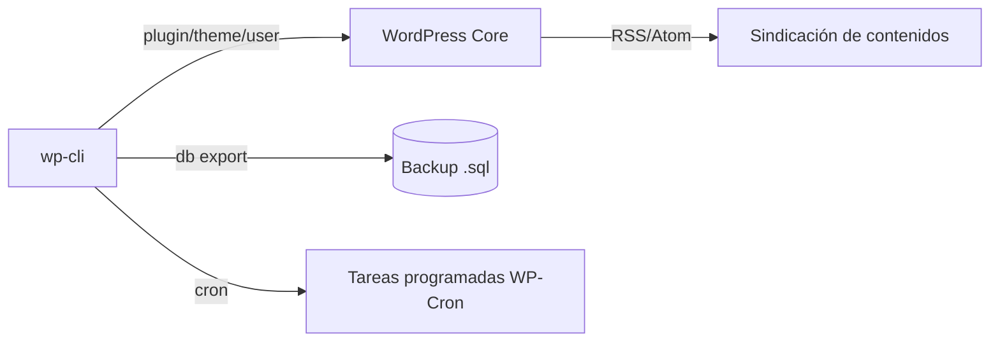

# UD8: Administración Avanzada de CMS y WP-CLI

!!! info "Ficha Técnica y Alcance de la Unidad"
    * **Carga Lectiva:** 5 horas presenciales
    * **Resultados de Aprendizaje:** RA2 (criterios g, h) + RA3 (criterios a-i íntegros)
    * **Tecnologías Involucradas:** [WordPress](tech/wordpress.md), [WP-CLI](tech/wp-cli.md), [Git](tech/git.md)
    * **Referencias y Estándares:** WP-CLI Handbook, OWASP Backup Security Cheat Sheet

---

## 📖 1. Fundamentos Teóricos y Arquitectura

La **administración** de un CMS (RA3) cubre usuarios/roles, módulos (plugins), plantillas (temas),
copias de seguridad, import/export y sindicación — todo automatizable vía **WP-CLI**, el cliente de
línea de comandos oficial que evita depender del panel web para tareas repetitivas o programadas
(*cron*, *pipelines*).



WordPress ofrece **roles predefinidos** (Administrador, Editor, Autor, Colaborador, Suscriptor) con
capacidades granulares (`edit_posts`, `manage_options`...), base del principio de mínimo privilegio
aplicado a un CMS multiusuario.

## ⚙️ 2. Instalación, Configuración Avanzada y Hardening

```bash title="Gestión de usuarios con roles diferenciados" linenums="1"
wp user create editor_ana ana@iaw.local --role=editor --user_pass="$(openssl rand -base64 12)"
wp user create autor_luis luis@iaw.local --role=author
wp user list --fields=ID,user_login,roles
```

```bash title="Instalación y activación controlada de plugins/temas" linenums="1"
wp plugin install wordfence --activate
wp plugin install wp-super-cache --activate
wp theme install twentytwentyfour --activate
wp plugin list --status=active
```

```bash title="Copia de seguridad completa (BD + ficheros) automatizada" linenums="1"
FECHA=$(date +%F)
wp db export "/backups/wp-db-${FECHA}.sql"
tar czf "/backups/wp-files-${FECHA}.tar.gz" wp-content/
find /backups -name "wp-*" -mtime +30 -delete   # retención 30 días
```

!!! danger "Seguridad y Hardening (CIS / CCN-CERT / OWASP)"
    Los `.sql` de backup contienen `wp_users.user_pass` (hash) y `wp_options` (posibles secretos);
    deben cifrarse en reposo (`gpg --symmetric`) y nunca ubicarse dentro del `DocumentRoot` público.

## 🛠️ 3. Laboratorio Práctico Dirigido

```bash title="Import/export de contenidos y verificación de sindicación" linenums="1"
wp import contenido-migracion.xml --authors=create
curl -s https://app.iaw.local/feed/ | xmllint --noout -   # valida el XML del RSS generado
wp plugin update --all                                    # actualización controlada de módulos
```

```bash title="Automatización con cron del sistema" linenums="1"
cat > /etc/cron.d/wp-backup << 'EOF'
0 3 * * * www-data /usr/local/bin/wp --path=/var/www/wordpress db export /backups/wp-db-$(date +\%F).sql
EOF
```

## 🛡️ 4. Seguridad, Logs y Optimización de Rendimiento

* `wp plugin verify-checksums` compara los ficheros instalados con los oficiales del repositorio,
  detectando modificaciones no autorizadas (*plugin* comprometido/*backdoor* inyectado).
* Informes de acceso: integrar el plugin de seguridad (Wordfence) con envío de alertas por *login*
  fallido repetido — mitiga *brute-force* contra `wp-login.php`.
* `wp cache flush` tras cambios de configuración evita servir contenido cacheado obsoleto.

## ❓ 5. Preguntas y Casos de Autoevaluación

1. **¿Por qué automatizar backups con WP-CLI + cron es preferible a un plugin de backup en el panel?**
   *Resolución:* No depende de que el proceso PHP-FPM del sitio esté disponible ni consume recursos
   del *pool* web durante el respaldo; es auditable como cualquier tarea de sistema (logs de cron).

2. **Un editor reporta que no puede publicar directamente, solo enviar a revisión. ¿Es un fallo?**
   *Resolución:* No; es el comportamiento esperado del rol `author` frente a `editor` en la matriz de
   capacidades de WordPress — verificar con `wp user list-caps <ID>` si el rol es el correcto.

3. **¿Qué garantiza `wp plugin verify-checksums` que una simple revisión visual no detecta?**
   *Resolución:* Compara hash criptográfico byte a byte contra el repositorio oficial, detectando
   *backdoors* inyectados en ficheros PHP que a simple vista parecen legítimos.

4. **¿Por qué los backups no deben residir dentro del `DocumentRoot` del sitio?**
   *Resolución:* Serían accesibles vía HTTP si la configuración del servidor no los bloquea
   explícitamente, exponiendo credenciales de usuarios y estructura completa de la BD.

5. **Diferencia entre "importar contenidos" y "migrar el sitio completo" en este contexto.**
   *Resolución:* Importar (RA3) trae posts/páginas/medios de un XML a un WordPress ya instalado;
   migrar implica además BD completa, `wp-config.php`, `.htaccess`/vhost y URLs (`wp search-replace`).
