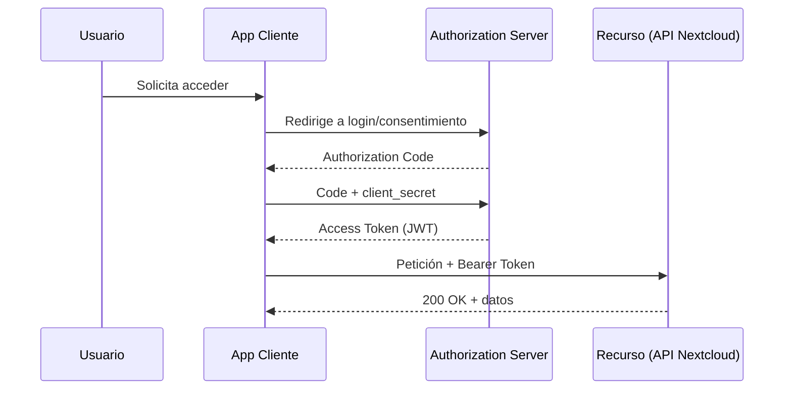

# UD10: Servicios SaaS y APIs Corporativas

!!! info "Ficha Técnica y Alcance de la Unidad"
    * **Carga Lectiva:** 5 horas presenciales
    * **Resultados de Aprendizaje:** RA4 (criterios e, f, g, h)
    * **Tecnologías Involucradas:** [Nextcloud](tech/nextcloud.md), APIs REST
    * **Referencias y Estándares:** OWASP API Security Top 10, RFC 6749 (OAuth 2.0), RFC 7519 (JWT)

---

## 📖 1. Fundamentos Teóricos y Arquitectura

La **integración de aplicaciones heterogéneas** en una intranet se resuelve exponiendo/consumiendo
**APIs REST** autenticadas. El estándar de facto para delegación de acceso sin compartir credenciales
es **OAuth 2.0** (RFC 6749): el usuario autoriza a una aplicación cliente a acceder a recursos en su
nombre mediante un *token* de acceso de vida limitada, sin exponer su contraseña al cliente.



## ⚙️ 2. Instalación, Configuración Avanzada y Hardening

```bash title="Activación de la app OAuth2/OIDC en Nextcloud" linenums="1"
sudo -u www-data php occ app:install oauth2
sudo -u www-data php occ config:app:set oauth2 login_scope --value=""
```

```bash title="Registro de cliente OAuth2 vía occ" linenums="1"
sudo -u www-data php occ oauth2:add-client \
  "Intranet-RRHH" \
  "https://intranet.iaw.local/callback"
```

```python title="Cliente Python consumiendo la API con token Bearer" linenums="1"
import httpx

TOKEN = "eyJhbGciOiJIUzI1NiIs..."  # obtenido tras el flujo OAuth2
resp = httpx.get(
    "https://app.iaw.local/ocs/v2.php/apps/files_sharing/api/v1/shares",
    headers={"Authorization": f"Bearer {TOKEN}", "OCS-APIRequest": "true"},
)
resp.raise_for_status()
print(resp.json()["ocs"]["data"])
```

!!! danger "Seguridad y Hardening (CIS / CCN-CERT / OWASP)"
    Validar siempre `exp` (expiración) y `aud` (audiencia) del JWT recibido (RFC 7519) antes de confiar
    en su contenido — OWASP API Security Top 10, categoría API2:2023 *Broken Authentication*.

## 🛠️ 3. Laboratorio Práctico Dirigido

```bash title="Prueba de integración cooperativa entre dos aplicaciones" linenums="1"
curl -X POST https://app.iaw.local/ocs/v2.php/apps/files_sharing/api/v1/shares \
  -H "Authorization: Bearer $TOKEN" -H "OCS-APIRequest: true" \
  -d "path=/Proyectos/IAW&shareType=3"   # shareType=3: enlace público
```

```bash title="Verificación de expiración del token" linenums="1"
echo "$TOKEN" | cut -d. -f2 | base64 -d 2>/dev/null | jq .exp
date -d @$(echo "$TOKEN" | cut -d. -f2 | base64 -d 2>/dev/null | jq .exp)
```

## 🛡️ 4. Seguridad, Logs y Optimización de Rendimiento

* Registrar en logs cada emisión/revocación de token (auditoría de acceso a la API, RA4 criterio g).
* Rotación de `client_secret` periódica y revocación inmediata ante sospecha de compromiso
  (`occ oauth2:delete-client <ID>`).
* Rate limiting a nivel de proxy (visto en UD3, `limit_req_zone`) aplicado específicamente a
  endpoints de autenticación (`/oauth2/api/v1/token`) para mitigar *credential stuffing*.

## ❓ 5. Preguntas y Casos de Autoevaluación

1. **¿Por qué OAuth 2.0 es preferible a que la app cliente pida usuario/contraseña directamente?**
   *Resolución:* Evita que el cliente almacene o vea las credenciales reales; el usuario puede revocar
   el acceso del cliente en cualquier momento sin cambiar su contraseña (principio de menor exposición).

2. **Un token JWT válido sintácticamente es rechazado por la API con 401. Causa probable.**
   *Resolución:* El campo `exp` ya expiró, o `aud`/`iss` no coinciden con lo esperado por el recurso —
   la validez criptográfica de la firma no implica que el token sea aceptable para ese contexto.

3. **¿Qué diferencia hay entre `Authorization Code` y `Implicit Grant` en OAuth 2.0?**
   *Resolución:* *Authorization Code* intercambia el código por el token en una llamada servidor-a-servidor
   (más seguro, oculta el token del navegador); *Implicit* lo devuelve directamente en la URL —
   desaconsejado actualmente por OWASP en favor de *Authorization Code + PKCE*.

4. **¿Por qué se debe registrar cada emisión de token en logs de auditoría?**
   *Resolución:* Permite trazabilidad forense ante un incidente (qué cliente accedió, cuándo, a qué
   recurso), requisito habitual de cumplimiento normativo (ENS, RGPD) en integraciones corporativas.

5. **Explica por qué el `client_secret` nunca debe incluirse en una app cliente pública (SPA/móvil).**
   *Resolución:* El código del cliente es inspeccionable por el usuario final; un secreto embebido
   dejaría de ser secreto — para esos casos se usa *Authorization Code + PKCE* sin `client_secret`.
