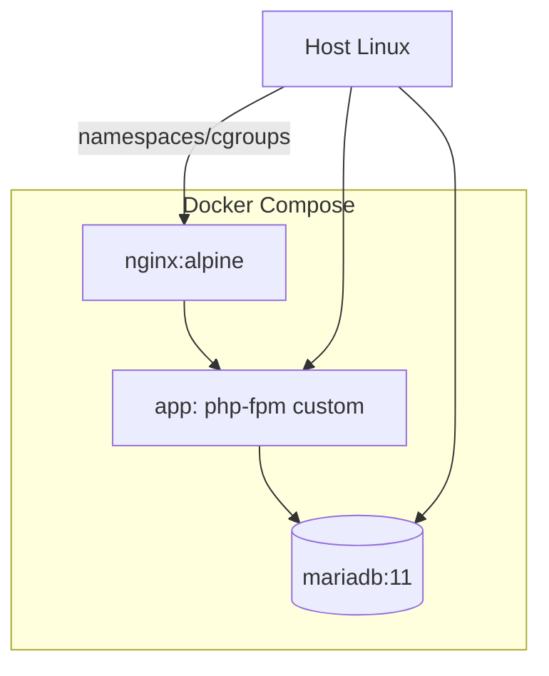

# UD11: Contenerización: Docker y Docker Compose

!!! info "Ficha Técnica y Alcance de la Unidad"
    * **Carga Lectiva:** 5 horas presenciales
    * **Resultados de Aprendizaje:** RA6 — ampliación tecnológica (criterios e, f: verificación de funcionamiento y rendimiento)
    * **Tecnologías Involucradas:** [Docker y Docker Compose](tech/docker.md)
    * **Referencias y Estándares:** Docker Engine Reference, CIS Docker Benchmark, OCI Image Spec

---

## 📖 1. Fundamentos Teóricos y Arquitectura

Docker empaqueta una aplicación con todas sus dependencias en una **imagen** inmutable (capas de
sistema de ficheros *overlay*), ejecutada como **contenedor** aislado mediante *namespaces* y
*cgroups* del kernel Linux — sin la sobrecarga de virtualización completa de una VM. **Docker Compose**
orquesta multi-contenedor (app + BD + proxy) declarativamente en un único fichero YAML.



## ⚙️ 2. Instalación, Configuración Avanzada y Hardening

```bash title="Instalación de Docker Engine desde el repositorio oficial" linenums="1"
curl -fsSL https://get.docker.com | sh
usermod -aG docker $(whoami)
systemctl enable --now docker
docker --version && docker compose version
```

```dockerfile title="Dockerfile — imagen de aplicación PHP mínima y no-root" linenums="1"
FROM php:8.3-fpm-alpine
RUN docker-php-ext-install pdo pdo_mysql
RUN addgroup -g 1000 appuser && adduser -D -u 1000 -G appuser appuser
COPY --chown=appuser:appuser ./src /var/www/app
USER appuser
WORKDIR /var/www/app
EXPOSE 9000
```

```yaml title="docker-compose.yml — stack completo del laboratorio" linenums="1"
version: "3.9"
services:
  nginx:
    image: nginx:1.27-alpine
    ports: ["443:443"]
    volumes:
      - ./nginx.conf:/etc/nginx/conf.d/default.conf:ro
      - ./src:/var/www/app:ro
    depends_on: [app]

  app:
    build: .
    restart: unless-stopped
    environment:
      - DB_HOST=db
    depends_on:
      db:
        condition: service_healthy

  db:
    image: mariadb:11
    environment:
      MARIADB_DATABASE: app_iaw
      MARIADB_USER: app_user
      MARIADB_PASSWORD_FILE: /run/secrets/db_pass
    secrets: [db_pass]
    healthcheck:
      test: ["CMD", "healthcheck.sh", "--connect"]
      interval: 10s
      retries: 5
    volumes: ["db_data:/var/lib/mysql"]

volumes:
  db_data:
secrets:
  db_pass:
    file: ./secrets/db_pass.txt
```

!!! danger "Seguridad y Hardening (CIS / CCN-CERT / OWASP)"
    `USER appuser` (no root) y `secrets:` (no `environment:` para contraseñas) son controles CIS Docker
    Benchmark 4.1 y 5.4 respectivamente; una imagen que corre como root en el contenedor facilita
    escalada si se combina con montajes de volumen mal configurados.

## 🛠️ 3. Laboratorio Práctico Dirigido

```bash title="Levantar el stack y verificar funcionamiento" linenums="1"
docker compose up -d --build
docker compose ps
docker compose logs -f app --tail=50
curl -Ik https://localhost/
```

```bash title="Pruebas de rendimiento básicas con ab (Apache Bench)" linenums="1"
docker exec -it $(docker compose ps -q nginx) nginx -t
ab -n 500 -c 20 https://localhost/   # 500 peticiones, 20 concurrentes
docker stats --no-stream             # consumo CPU/RAM en tiempo real por contenedor
```

## 🛡️ 4. Seguridad, Logs y Optimización de Rendimiento

* `docker compose logs` centraliza *stdout/stderr* de todos los servicios; en producción se reenvían
  a un *driver* de logging externo (`json-file` con `max-size` para evitar llenar el disco del host).
* `healthcheck:` en `db` evita que `app` arranque antes de que MariaDB esté realmente lista, previniendo
  fallos de conexión en el primer arranque del stack (condición de carrera clásica en orquestación).
* Limitar recursos por contenedor (`deploy.resources.limits` en modo *stack*, o `--memory`/`--cpus`
  en `docker run`) evita que un contenedor defectuoso agote recursos del host compartido.

## ❓ 5. Preguntas y Casos de Autoevaluación

1. **¿Por qué Docker es más ligero que una máquina virtual tradicional?**
   *Resolución:* Comparte el kernel del host (namespaces para aislamiento de procesos/red/filesystem,
   cgroups para límites de recursos), sin arrancar un sistema operativo completo por contenedor.

2. **El contenedor `app` falla al arrancar con "Connection refused" a la BD. Causa y solución.**
   *Resolución:* `app` intenta conectar antes de que MariaDB termine su inicialización; solución:
   `depends_on.db.condition: service_healthy` con un `healthcheck` bien definido, no solo `depends_on` simple.

3. **¿Por qué usar `secrets:` en vez de `environment:` para la contraseña de BD?**
   *Resolución:* Las variables de entorno son visibles vía `docker inspect` y en procesos hijos;
   los *secrets* se montan como fichero temporal en `/run/secrets/`, con exposición más controlada.

4. **¿Qué garantiza ejecutar el proceso PHP como `appuser` (UID 1000) y no como `root`?**
   *Resolución:* En caso de compromiso de la aplicación (RCE), el atacante obtiene privilegios limitados
   dentro del contenedor, reduciendo el impacto de un posible *container breakout*.

5. **Explica qué mide `ab -n 500 -c 20` y por qué es relevante tras un despliegue en contenedores.**
   *Resolución:* Lanza 500 peticiones con 20 en paralelo, midiendo tiempo de respuesta y throughput;
   permite verificar que la limitación de recursos del contenedor no degrada el rendimiento esperado.
