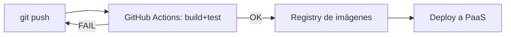

# UD12: CI/CD y Despliegue Cloud PaaS

!!! info "Ficha Técnica y Alcance de la Unidad"
    * **Carga Lectiva:** 5 horas presenciales
    * **Resultados de Aprendizaje:** RA6 — ampliación tecnológica (criterio g: verificación de funcionamiento y rendimiento del sistema) · Objetivo general p) del ciclo
    * **Tecnologías Involucradas:** [GitHub Actions](tech/github-actions.md), [Docker](tech/docker.md)
    * **Referencias y Estándares:** GitHub Actions Documentation, The Twelve-Factor App, OWASP CI/CD Security Top 10

---

## 📖 1. Fundamentos Teóricos y Arquitectura

**CI/CD** (*Continuous Integration / Continuous Deployment*) automatiza el ciclo build → test → deploy
en cada cambio de código, verificando funcionamiento antes de que llegue a producción. Un **pipeline**
se define declarativamente (YAML) y se dispara ante eventos del repositorio (`push`, `pull_request`).



Un **PaaS** (*Platform as a Service*) abstrae la infraestructura subyacente: el equipo despliega
contenedores/artefactos sin gestionar servidores directamente (Render, Railway, Fly.io, Azure App
Service), acelerando el ciclo de entrega frente a IaaS tradicional.

## ⚙️ 2. Instalación, Configuración Avanzada y Hardening

```yaml title=".github/workflows/ci-cd.yml — pipeline completo" linenums="1"
name: CI/CD IAW
on:
  push:
    branches: [main]
  pull_request:
    branches: [main]

jobs:
  build-and-test:
    runs-on: ubuntu-latest
    steps:
      - uses: actions/checkout@v4

      - name: Construir imagen
        run: docker build -t app-iaw:${{ github.sha }} .

      - name: Levantar stack de pruebas
        run: docker compose -f docker-compose.test.yml up -d --build

      - name: Ejecutar tests de humo
        run: |
          sleep 5
          curl -f http://localhost:8080/health || exit 1

      - name: Analizar vulnerabilidades de la imagen
        uses: aquasecurity/trivy-action@master
        with:
          image-ref: "app-iaw:${{ github.sha }}"
          severity: "CRITICAL,HIGH"
          exit-code: "1"

  deploy:
    needs: build-and-test
    if: github.ref == 'refs/heads/main'
    runs-on: ubuntu-latest
    steps:
      - name: Desplegar en PaaS
        run: |
          curl -X POST "https://api.paas-provider.com/deploy" \
            -H "Authorization: Bearer ${{ secrets.PAAS_DEPLOY_TOKEN }}" \
            -d '{"image": "app-iaw:${{ github.sha }}"}'
```

!!! danger "Seguridad y Hardening (CIS / CCN-CERT / OWASP)"
    El token de despliegue va en **GitHub Secrets** (`secrets.PAAS_DEPLOY_TOKEN`), nunca en el YAML
    en claro; el escaneo con Trivy bloquea el pipeline (`exit-code: "1"`) ante vulnerabilidades
    críticas/altas conocidas en la imagen — control equivalente a OWASP CI/CD Top 10, CICD-SEC-3.

## 🛠️ 3. Laboratorio Práctico Dirigido

```bash title="Simulación local del pipeline antes de subir a GitHub" linenums="1"
docker build -t app-iaw:local .
docker compose -f docker-compose.test.yml up -d --build
sleep 5 && curl -f http://localhost:8080/health
docker compose -f docker-compose.test.yml down -v
```

```bash title="Verificación del despliegue tras el pipeline en producción" linenums="1"
curl -s https://app.iaw.local/health | jq .
curl -s https://app.iaw.local/version | jq -r .commit_sha
# Debe coincidir con el SHA del último commit en main
```

## 🛡️ 4. Seguridad, Logs y Optimización de Rendimiento

* La pestaña **Actions** de GitHub conserva el log completo de cada ejecución (build, test, deploy):
  auditoría automática de qué cambio provocó qué despliegue, y en qué momento.
* Test de humo (`curl -f .../health`) verifica funcionamiento mínimo antes de considerar el
  despliegue exitoso — criterio explícito de RA6.g ("verificado el funcionamiento y el rendimiento").
* Etiquetar imágenes con el SHA del commit (no `latest`) garantiza trazabilidad exacta entre código
  desplegado y versión del repositorio, facilitando *rollback* inmediato a un SHA anterior conocido.

## ❓ 5. Preguntas y Casos de Autoevaluación

1. **¿Por qué el job `deploy` depende de `build-and-test` (`needs:`) y no se ejecuta en paralelo?**
   *Resolución:* Garantiza que nunca se despliega código que no ha pasado el build ni los tests de
   humo; es la esencia de CI/CD: fallar rápido y bloquear el paso a producción ante cualquier error.

2. **El pipeline pasa en CI pero la app falla en producción tras el deploy. ¿Qué faltaría añadir?**
   *Resolución:* Un test de humo post-despliegue real contra el entorno de producción (o *staging*
   idéntico), no solo contra el stack local de `docker-compose.test.yml`.

3. **¿Por qué etiquetar imágenes con `${{ github.sha }}` en vez de siempre `latest`?**
   *Resolución:* `latest` es mutable y ambiguo (no se sabe qué versión exacta corre); el SHA del
   commit ata inequívocamente la imagen desplegada al código fuente exacto, esencial para *rollback*.

4. **¿Qué previene el escaneo de vulnerabilidades (Trivy) con `exit-code: "1"` en el pipeline?**
   *Resolución:* Bloquea automáticamente el paso a `deploy` si la imagen contiene CVEs críticas/altas
   conocidas en sus dependencias del SO o paquetes, sin depender de revisión manual.

5. **Explica por qué `secrets.PAAS_DEPLOY_TOKEN` no debe imprimirse nunca con `echo` en un step del pipeline.**
   *Resolución:* Quedaría expuesto en los logs de ejecución de Actions (visibles según permisos del
   repo); GitHub enmascara automáticamente los `secrets` referenciados correctamente, pero un `echo`
   directo del valor podría evadir ese enmascaramiento si se manipula la cadena.
