# UD2: Servidores Web Clásicos: Apache HTTP Server

!!! info "Ficha Técnica y Alcance de la Unidad"
    * **Carga Lectiva:** 4 horas presenciales
    * **Resultados de Aprendizaje:** RA1 (criterios d, e, f)
    * **Tecnologías Involucradas:** [Apache HTTP Server](https://jmfiorisies.github.io/tech/apache/), PHP-FPM (se detalla en UD4, no incluida en este repositorio)
    * **Referencias y Estándares:** CIS Apache HTTP Server Benchmark, CCN-STIC-599A20, OWASP ASVS

!!! tip "Cómo está organizada esta unidad"
    Sigue el mismo orden que la presentación de clase, en cinco bloques: **(1)** cómo atiende Apache
    varias conexiones a la vez (MPM), **(2)** cómo aloja varios sitios en un mismo servidor
    (VirtualHosts), **(3)** cómo se le añade funcionalidad (módulos), **(4)** `.htaccess`, reescritura de
    URLs y seguridad básica, y **(5)** límite de peticiones y logs. Cada bloque necesita al anterior:
    no se entiende bien un VirtualHost sin saber cómo gestiona Apache la concurrencia, ni `.htaccess`
    sin haber visto antes los módulos.

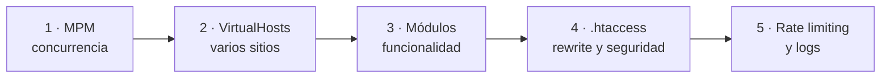

---

## 📖 1. Fundamentos Teóricos y Arquitectura

### 1.1 ¿Qué es exactamente un "servidor web"?

En UD1 vimos que el servidor es el programa que escucha peticiones HTTP y responde. **Apache HTTP
Server** (mantenido por la Apache Software Foundation, de ahí "ASF") es uno de los programas más
usados del mundo para cumplir ese papel. Cuando lo instalamos, se convierte en un **servicio** del
sistema operativo: un programa que arranca junto al sistema y permanece en ejecución en segundo
plano, sin que nadie tenga que "abrirlo" manualmente (como sí haríamos con un editor de texto). Quien
gestiona ese arranque automático en Debian/Ubuntu es **systemd**, el sistema de inicio: es el mismo
mecanismo que arrancará PHP-FPM en UD4, Nginx en UD3 o cualquier otro servicio del módulo — conviene
familiarizarse con sus comandos ahora porque se repetirán constantemente el resto del curso.

Puedes comprobar que un servicio está en marcha con `systemctl status apache2`; lo arrancamos,
paramos o reiniciamos con `systemctl start|stop|restart apache2`.

!!! note "¿Por qué seguir aprendiendo Apache si existe Nginx?"
    Apache y Nginx juntos sirven la inmensa mayoría del tráfico web mundial, y no son "el viejo contra
    el moderno": tienen puntos fuertes distintos y en el mundo real suelen **convivir** en la misma
    infraestructura. Apache es más flexible gracias a sus módulos y a `.htaccess` (de ahí su peso en el
    *hosting* compartido y en aplicaciones PHP como WordPress); Nginx destaca como proxy inverso y
    servidor de estáticos. "Antiguo" no significa "abandonado": Apache sigue recibiendo parches de
    seguridad activos.

### 1.2 Contenido estático vs. contenido dinámico

Antes de hablar de cómo Apache gestiona la concurrencia, hay que distinguir dos tipos de contenido
que un servidor puede servir:

- **Estático:** el fichero que se envía es exactamente el que hay guardado en el disco (una imagen
  `.jpg`, un `.html` fijo). El servidor solo tiene que "leer y enviar", sin procesar nada.
- **Dinámico:** el contenido se genera en el momento, ejecutando código (por ejemplo, un script PHP
  que consulta una base de datos y construye el HTML al vuelo, antes de enviarlo). Esto es mucho más
  costoso en CPU que servir un fichero estático, y es la razón por la que existen mecanismos
  específicos (como PHP-FPM, que veremos en este UD) para gestionar ese procesamiento de forma
  eficiente y separada del propio servidor web.

### 1.3 ¿Cómo atiende Apache a varios usuarios a la vez? Procesos, hilos y MPM

Si dos personas piden una página al mismo tiempo, el servidor tiene que poder atenderlas a las dos sin
que una tenga que esperar a que termine la otra. Para entender cómo lo resuelve Apache, conviene fijar
dos conceptos básicos de sistemas operativos:

- **Proceso:** una copia en ejecución de un programa, con su propia memoria reservada, totalmente
  aislada de otros procesos. Crear un proceso nuevo tiene cierto coste (tiempo y memoria).
- **Hilo (thread):** una "sub-tarea" dentro de un mismo proceso, que comparte memoria con los demás
  hilos de ese proceso. Crear un hilo es más barato que crear un proceso completo, pero al compartir
  memoria hay que tener cuidado con el código que no está preparado para ejecutarse en paralelo sin
  interferencias (código *no thread-safe*).

!!! example "La analogía de la oficina"
    Un **proceso** es una oficina completa, con su propio mobiliario y aislada de la de al lado: si algo
    se rompe dentro, no afecta a la oficina vecina, pero montar una oficina nueva es caro. Un **hilo** es
    un empleado más dentro de esa oficina: contratarlo es barato, pero comparte mesas y armarios (la
    memoria) con sus compañeros, y si dos usan el mismo cajón a la vez sin coordinarse, se pisan. Eso
    último es una **condición de carrera** (*race condition*): el resultado depende de quién "gane".

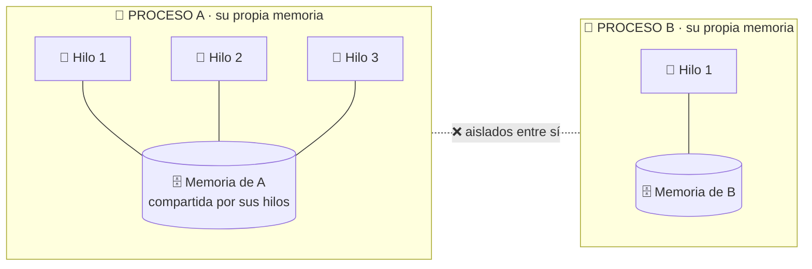

Apache permite elegir cómo organiza esta concurrencia mediante un **MPM** (*Multi-Processing
Module*), y hay tres modelos disponibles:

| MPM | Cómo atiende conexiones | Cuándo usarlo |
|---|---|---|
| **prefork** | Un proceso completo por cada conexión | Compatible con módulos antiguos no *thread-safe* como `mod_php` clásico |
| **worker** | Procesos con varios hilos cada uno | Más eficiente en memoria que prefork |
| **event** | Variante de worker que además delega la gestión de conexiones inactivas (*keep-alive*) a hilos dedicados | Recomendado en producción moderna, especialmente junto a PHP-FPM externo |

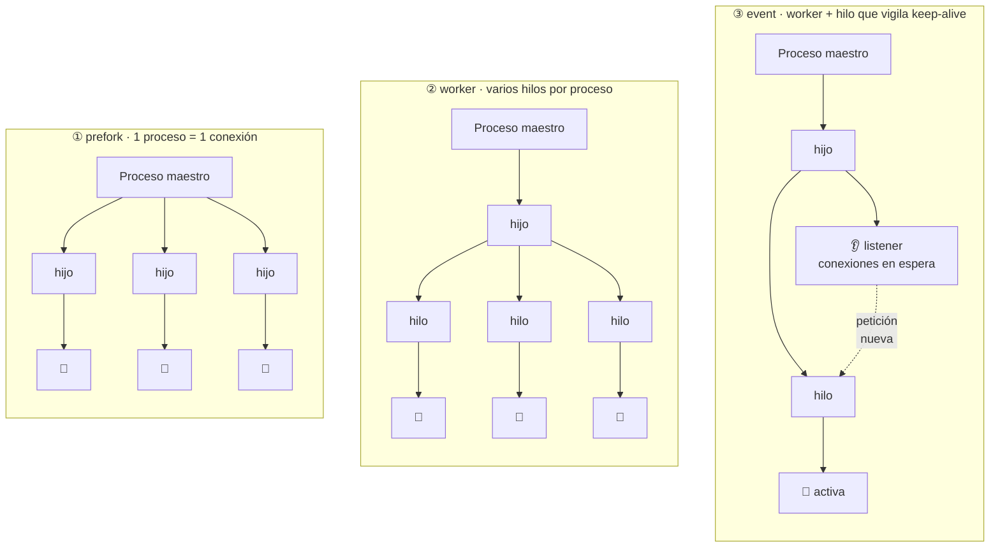

Muchos despliegues reales siguen usando `prefork` **no porque no sepan** que `event` es mejor, sino
porque dependen de `mod_php` clásico, que no es *thread-safe*. Es una dependencia técnica heredada, no
una cuestión de moda: el MPM se elige según lo que ejecuta el sitio.

```bash title="¿Qué MPM tiene activo un Apache que no he instalado yo?"
apache2ctl -V | grep -i "Server MPM"     # Server MPM: event
```

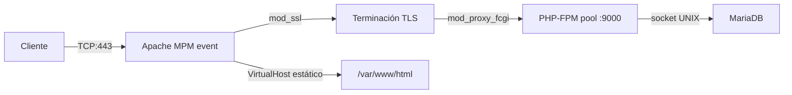

En despliegues modernos con PHP-FPM se recomienda **event + mod_proxy_fcgi**: Apache (rápido y
ligero, gestionando muchas conexiones simultáneas) delega la parte pesada — ejecutar PHP — a un
programa externo especializado (PHP-FPM), que se estudiará con más detalle en UD4. Esta separación de
responsabilidades es un patrón muy habitual en arquitecturas de servidores.

### 1.4 ¿Dónde vive la configuración de Apache?

Antes de tocar ningún fichero conviene tener el mapa completo — si no, cada ruta nueva que aparezca
parecerá sacada de la nada. En Debian/Ubuntu, Apache organiza su configuración así:

| Ruta | Contenido |
|---|---|
| `/etc/apache2/apache2.conf` | Fichero principal: carga todo lo demás mediante directivas `Include` |
| `/etc/apache2/ports.conf` | En qué puertos escucha Apache (`Listen 80`, `Listen 443`) |
| `/etc/apache2/sites-available/` | **Borrador** de cada VirtualHost — puede haber muchos, estén activos o no |
| `/etc/apache2/sites-enabled/` | Solo los VirtualHosts **activos**: son enlaces simbólicos a ficheros de `sites-available/` |
| `/etc/apache2/mods-available/` y `mods-enabled/` | Igual que los sitios, pero para módulos |
| `/etc/apache2/conf-available/` y `conf-enabled/` | Fragmentos de configuración global (por ejemplo `security.conf`) |
| `/var/www/` | Carpeta por defecto donde vive el contenido de los sitios (el `DocumentRoot`) |
| `/var/log/apache2/` | Registro de actividad y errores |

La separación *available* vs. *enabled* es el mismo patrón en sitios, módulos y configuración: tener
un fichero en `sites-available` no activa nada por sí solo, es solo un borrador guardado; hace falta
"encenderlo" explícitamente para que Apache lo cargue:

| Qué | Activar | Desactivar |
|---|---|---|
| Sitios (VirtualHosts) | `a2ensite sitio.conf` | `a2dissite sitio.conf` |
| Módulos | `a2enmod modulo` | `a2dismod modulo` |
| Configuración global | `a2enconf fichero` | `a2disconf fichero` |

Estos comandos solo crean o borran el **enlace simbólico**; el cambio no llega al Apache que ya está
en marcha hasta que se le pide que relea la configuración (`systemctl reload apache2`).

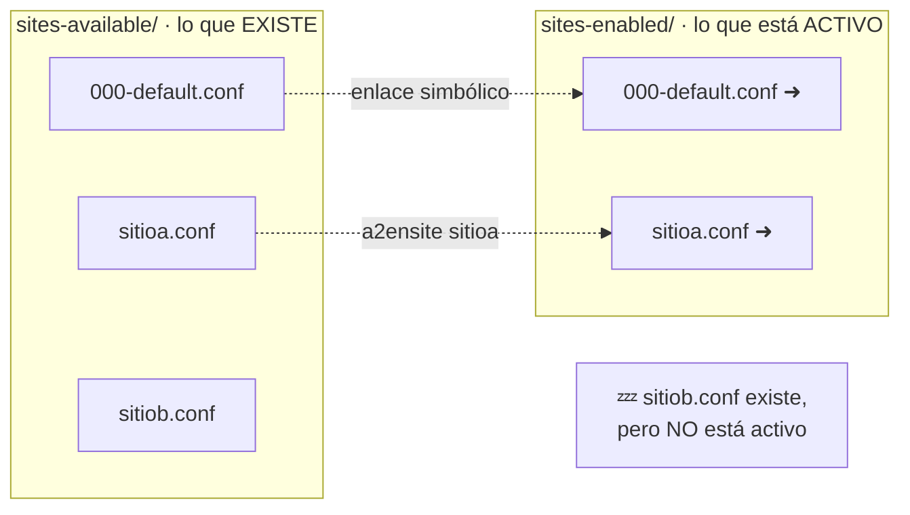

Con `ls -l /etc/apache2/sites-enabled/` verás la flecha `->` de cada enlace. La gran ventaja del
patrón: `a2dissite` desactiva un sitio **sin borrar su configuración**.

### 1.5 ¿Qué es un VirtualHost?

Un mismo servidor físico (o virtual) puede alojar **varios sitios web distintos** a la vez, cada uno
con su propio dominio, sus propios ficheros y su propia configuración. Cada uno de esos sitios se
define en Apache como un **VirtualHost**: un bloque de configuración que le dice a Apache "cuando
llegue una petición para *este* dominio, sírvela desde *esta* carpeta, con *esta* configuración de
TLS". Sin VirtualHosts, cada dominio necesitaría su propia máquina física — algo enormemente
ineficiente si el tráfico de cada sitio es moderado.

Las directivas básicas de un VirtualHost son:

| Directiva | Para qué sirve |
|---|---|
| `ServerName` | El dominio principal que atiende este bloque |
| `ServerAlias` | Otros nombres que también atiende (típicamente la versión con y sin `www`) |
| `DocumentRoot` | La carpeta del disco desde la que se sirven los ficheros del sitio |
| `ErrorLog` / `CustomLog` | Logs **propios** de este sitio, para diagnosticarlo por separado del resto |

Sin `ServerAlias`, una petición a `www.sitioa.iaw.local` no coincidiría con `ServerName
sitioa.iaw.local` y caería en otro VirtualHost. Y con logs propios por sitio, encontrar el problema de
uno de diez dominios deja de ser buscar una aguja en un pajar.

### 1.6 Con varios VirtualHosts en el mismo puerto, ¿cómo sabe Apache cuál usar?

Esto suele ser el punto que menos se entiende a la primera, así que vale la pena pararse: si `app.iaw.local`
y `otroweb.local` comparten la misma IP y el mismo puerto 443, ¿cómo distingue Apache qué VirtualHost
debe atender cada petición? La respuesta conecta directamente con algo que ya vimos en UD1:

- **Sin cifrar (HTTP):** Apache lee la cabecera `Host:` que el navegador envía en la propia petición
  (la misma que vimos en el ejemplo de UD1 — `Host: app.iaw.local`) y la compara con el `ServerName`
  y los `ServerAlias` de cada VirtualHost disponible.
- **Cifrado (HTTPS):** el problema es que, en teoría, hace falta saber *qué certificado* enviar antes
  incluso de que la petición HTTP (con su cabecera `Host`) llegue a viajar cifrada. Esto se resuelve
  con **SNI** (*Server Name Indication*): el navegador indica el dominio deseado, en claro, como parte
  del propio saludo inicial de TLS, antes de que empiece el cifrado — así Apache ya sabe qué
  certificado y qué VirtualHost usar desde el primer momento.

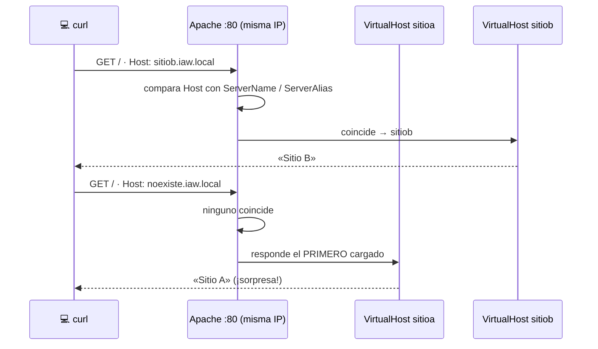

Si ningún `ServerName` coincide, Apache usa el **primer VirtualHost definido** como respuesta por
defecto — por eso el orden en que se activan los sitios importa, y por eso es buena práctica tener
siempre un VirtualHost "por defecto" explícito y controlado.

!!! warning "La IP no decide qué sitio se sirve"
    Con VirtualHosts basados en nombre, la IP y el puerto pueden ser idénticos para todos los sitios:
    lo único que cambia entre una petición y otra es la cabecera `Host` (o el SNI). Y si dos
    VirtualHosts tienen **el mismo** `ServerName` (el típico copia-pega sin cambiarlo), solo responde
    el primero; el segundo queda inaccesible por ese nombre.

```bash title="Ver qué VirtualHost atiende cada nombre y cuál es el de por defecto"
apache2ctl -S
```

`apache2ctl -S` lista, puerto por puerto, qué VirtualHosts hay cargados, de qué fichero sale cada uno y
cuál es el **default server** que responderá cuando no coincida ningún nombre.

### 1.7 Módulos dinámicos: añadir (y quitar) funcionalidad

Casi todo lo que hace Apache más allá de "servir ficheros" lo aportan **módulos**: piezas que se
cargan o se descargan sin recompilar el servidor, con el mismo patrón *available → enabled* de los
sitios.

| Módulo | Qué aporta | ¿Lo necesito? |
|---|---|---|
| `ssl` | HTTPS / TLS | Si sirves HTTPS |
| `headers` | Añadir o quitar cabeceras HTTP (HSTS, `X-Content-Type-Options`…) | Casi siempre, para hardening |
| `rewrite` | Reescritura de URLs (bloque 4) | Si usas URLs amigables o redirecciones con reglas |
| `proxy`, `proxy_fcgi` | Pasar peticiones a PHP-FPM u otros servidores | Si usas PHP-FPM o haces de proxy |
| `status` | Página `/server-status` con el estado interno | Solo si monitorizas, y **restringido por IP** |
| `autoindex` | Genera el listado "Index of /" de un directorio | Casi nunca: es el origen de los listados expuestos |
| `evasive` | Límite de peticiones por IP (bloque 5) | Recomendable en sitios expuestos |

```bash title="Revisar y ajustar los módulos activos"
apache2ctl -M                 # módulos cargados ahora mismo
a2enmod rewrite headers       # activar
a2dismod status autoindex     # desactivar lo que no se usa
apachectl configtest && systemctl reload apache2
```

!!! danger "Superficie mínima de ataque"
    Cada módulo activo es código que un atacante puede intentar explotar o que puede filtrar
    información (`mod_status` expone el estado interno del servidor; `mod_info`, su configuración). El
    principio es el mismo que verás en SAD al bastionar un sistema completo: **lo que no se usa, se
    desactiva**. Para saber qué sobra, revisa qué necesitan realmente tus VirtualHosts activos.

## ⚙️ 2. Instalación, Configuración Avanzada y Hardening

### 2.1 Instalación

```bash title="Instalación Apache + PHP-FPM en Debian/Ubuntu Server" linenums="1"
apt install -y apache2 php8.3-fpm libapache2-mod-fcgid
a2enmod proxy proxy_fcgi setenvif rewrite ssl headers
a2dismod mpm_prefork
a2enmod mpm_event
systemctl restart apache2
```

`a2enmod`/`a2dismod` (*Apache 2 enable/disable module*) activan o desactivan **módulos**: piezas de
funcionalidad opcional que se pueden añadir a Apache sin recompilarlo (aquí activamos el proxy hacia
FastCGI, la reescritura de URLs, TLS y la gestión de cabeceras HTTP). Usamos `systemctl restart` (no
`reload`) porque cambiar el MPM activo es un cambio estructural del propio proceso maestro de Apache,
no una simple recarga de configuración — `reload` no basta aquí.

!!! example "Laboratorio / Despliegue Real"
    Antes de complicar nada con TLS o PHP, comprueba que la instalación por defecto ya funciona:
    `curl -I http://localhost/` debería devolver `200 OK` y servir la página de bienvenida de Apache
    (`/var/www/html/index.html`, creada automáticamente por el paquete). Si esto falla, ningún paso
    posterior va a funcionar — resuelve esto primero.

### 2.2 Tu primer VirtualHost (HTTP), paso a paso

El orden de trabajo es siempre el mismo, y conviene memorizarlo porque es el que seguirás en el
laboratorio:

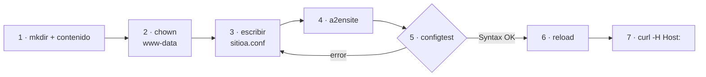

```bash title="1-2 · Carpeta, contenido y propietario"
mkdir -p /var/www/sitioa
echo "<h1>Sitio A</h1>" > /var/www/sitioa/index.html
chown -R www-data:www-data /var/www/sitioa
```

`chown www-data:www-data` asigna la carpeta al usuario con el que **realmente** se ejecuta Apache (no
root, por seguridad — principio de mínimo privilegio): así el proceso puede leer esos ficheros sin
necesitar permisos de administrador. Apache **no crea** la carpeta por ti: si el `DocumentRoot` apunta
a una ruta inexistente o mal escrita, obtendrás 403/404.

```apache title="3 · /etc/apache2/sites-available/sitioa.conf" linenums="1"
<VirtualHost *:80>
    ServerName sitioa.iaw.local
    ServerAlias www.sitioa.iaw.local
    DocumentRoot /var/www/sitioa

    ErrorLog ${APACHE_LOG_DIR}/sitioa_error.log
    CustomLog ${APACHE_LOG_DIR}/sitioa_access.log combined
</VirtualHost>
```

```bash title="4-7 · Activar, validar, recargar y comprobar"
a2ensite sitioa.conf
apachectl configtest          # Syntax OK — NUNCA te saltes este paso
systemctl reload apache2
curl -H "Host: sitioa.iaw.local" http://localhost/
```

Con `curl -H "Host: …"` no hace falta tocar el DNS ni `/etc/hosts`: le dices a Apache qué dominio
estás pidiendo aunque te conectes a `localhost`. Para probarlo desde el navegador, sí tendrás que
añadir `127.0.0.1 sitioa.iaw.local` a `/etc/hosts`.

### 2.3 VirtualHost HTTPS con PHP-FPM

Ahora sí, preparamos un sitio de producción con TLS (el certificado de UD1) y PHP ejecutado por
PHP-FPM:

```bash title="Crear el DocumentRoot del sitio" linenums="1"
mkdir -p /var/www/app
echo "<h1>Funciona: app.iaw.local</h1>" > /var/www/app/index.html
chown -R www-data:www-data /var/www/app
```

```apache title="/etc/apache2/sites-available/app-segura.conf" linenums="1"
<VirtualHost *:443>
    ServerName app.iaw.local
    DocumentRoot /var/www/app

    SSLEngine on
    SSLCertificateFile /etc/ssl/lab/lab.crt
    SSLCertificateKeyFile /etc/ssl/lab/lab.key
    SSLProtocol -all +TLSv1.3 +TLSv1.2
    SSLCipherSuite HIGH:!aNULL:!MD5:!3DES

    <FilesMatch "\.php$">
        SetHandler "proxy:unix:/run/php/php8.3-fpm.sock|fcgi://localhost"
    </FilesMatch>

    Header always set Strict-Transport-Security "max-age=63072000; includeSubDomains"
    Header always set X-Content-Type-Options "nosniff"
    Header unset X-Powered-By

    ErrorLog ${APACHE_LOG_DIR}/app_error.log
    CustomLog ${APACHE_LOG_DIR}/app_access.log combined
</VirtualHost>
```

Explicación línea a línea de lo esencial: `ServerName` es precisamente el valor que Apache compara
contra la cabecera `Host`/SNI del apartado 1.6 para elegir este bloque; `DocumentRoot` es la carpeta
que acabamos de crear; `SSLCertificateFile`/`SSLCertificateKeyFile` cargan el certificado y clave
generados en UD1; y `<FilesMatch "\.php$">` indica que **cualquier fichero que termine en `.php`**
debe procesarse de forma especial (no enviarse tal cual, sino ejecutarse) — ahí es donde entra
PHP-FPM.

`SetHandler proxy:unix:...fcgi://localhost` conecta Apache al *socket* UNIX de PHP-FPM: evita el coste
de un socket TCP local y aísla el intérprete PHP en un proceso con su propio usuario/grupo (`www-data`
o dedicado), cumpliendo el principio de mínimo privilegio de CIS Benchmark 3.x.

!!! danger "Seguridad y Hardening (CIS / CCN-CERT / OWASP)"
    `Header unset X-Powered-By` y `ServerTokens Prod` / `ServerSignature Off` en `/etc/apache2/conf-enabled/security.conf`
    evitan fuga de versión exacta del *stack* (CIS 3.1, CCN-STIC-599A20 §4.2).

## 🧩 3. `.htaccess`, Reescritura de URLs y Seguridad Básica

### 3.1 URLs amigables con `mod_rewrite`

Compara `producto.php?id=42` con `/producto/42`. La segunda es mejor para el usuario (se lee, se
recuerda y se comparte mejor) y para los buscadores (SEO). Por debajo sigue respondiendo el mismo
`producto.php`: `mod_rewrite` solo **traduce** la URL antes de que llegue al fichero real.

```apache title=".htaccess en /var/www/tienda" linenums="1"
RewriteEngine On
RewriteCond %{REQUEST_FILENAME} !-f
RewriteCond %{REQUEST_FILENAME} !-d
RewriteRule ^producto/([0-9]+)$ producto.php?id=$1 [L]
```

| Línea | Qué hace |
|---|---|
| `RewriteEngine On` | Activa el motor de reescritura (requiere `a2enmod rewrite`) |
| `RewriteCond … !-f` / `!-d` | Solo sigue si lo pedido **no** es un fichero ni un directorio que ya existan |
| `RewriteRule ^producto/([0-9]+)$` | Expresión regular: `producto/` seguido de uno o más dígitos, que se capturan en `$1` |
| `producto.php?id=$1` | La URL real a la que se traduce internamente |
| `[L]` | *Last*: si esta regla se aplica, no se evalúan las siguientes |

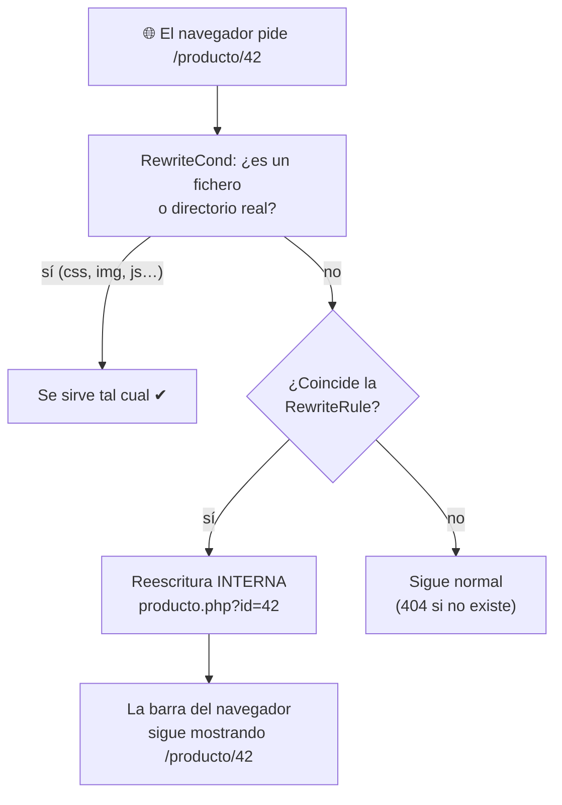

!!! warning "La línea que más se olvida: `RewriteCond … !-f`"
    Sin ella, Apache intentaría reescribir **también** las peticiones a ficheros que ya existen — una
    imagen, un CSS, un JS —, rompiéndolas por el camino.

**Reescribir no es redirigir.** Con la regla anterior, el navegador sigue mostrando `/producto/42`
porque la traducción ocurre dentro del servidor. Si añades la bandera `[R=301,L]`, Apache responde con
una **redirección**: el navegador recibe la URL nueva, hace una segunda petición y la barra de
direcciones cambia. Se usa, por ejemplo, para forzar HTTPS o para mover contenido de sitio:

```apache title="Redirección permanente de HTTP a HTTPS"
RewriteEngine On
RewriteCond %{HTTPS} off
RewriteRule ^ https://%{HTTP_HOST}%{REQUEST_URI} [R=301,L]
```

!!! note "Dentro de `.htaccess` o dentro del VirtualHost"
    En un `.htaccess`, el patrón se compara con la ruta **sin** la barra inicial (`^producto/…`). Si
    pones la misma regla directamente en el VirtualHost, la ruta **incluye** la barra: `^/producto/…`.
    Es el error más típico al pasar reglas de un sitio a otro. Para depurar una regla que no hace lo
    que esperas, sube temporalmente el nivel de log del módulo: `LogLevel warn rewrite:trace3`, y mira
    `error.log`.

### 3.2 `.htaccess`: cuándo sí y cuándo no

Un `.htaccess` es un fichero de configuración que se coloca **dentro de una carpeta del sitio** y
afecta a esa carpeta y a todas sus subcarpetas. Existe para un caso muy concreto: el **hosting
compartido**, donde el cliente no tiene acceso a `apache2.conf` ni a los VirtualHosts (los gestiona el
proveedor) y `.htaccess` es la única vía para configurar su propio directorio.

El precio es el rendimiento: con `.htaccess` permitido, Apache **relee** esos ficheros **en cada
petición**, y no solo en la carpeta pedida, sino en **todas** las carpetas desde el `DocumentRoot`
hasta ella.

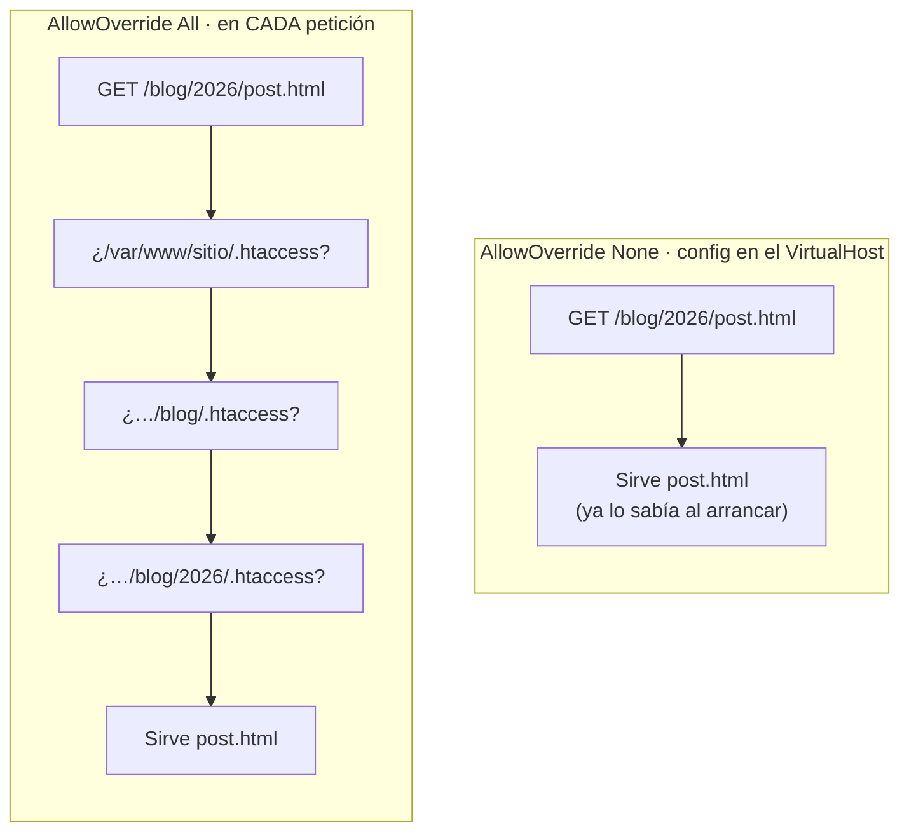

Quien decide si se leen o no es la directiva `AllowOverride`, dentro de un bloque `<Directory>`:

| Valor | Efecto |
|---|---|
| `AllowOverride None` | Apache **ignora** los `.htaccess` de esa ruta (y no gasta tiempo buscándolos) |
| `AllowOverride All` | Un `.htaccess` puede cambiar casi cualquier cosa |
| `AllowOverride FileInfo AuthConfig Limit Options` | Solo permite ciertos grupos: reescritura (`FileInfo`), control de acceso (`AuthConfig`, `Limit`) y `Options` |

!!! warning "Por qué \"mi `.htaccess` no hace nada\""
    En Debian/Ubuntu, `apache2.conf` trae de serie `AllowOverride None` para `/var/www/`, así que **los
    `.htaccess` se ignoran** hasta que lo cambies en el VirtualHost:

    ```apache
    <Directory /var/www/sitiob>
        AllowOverride FileInfo AuthConfig Limit Options
    </Directory>
    ```

    Y ojo: si el `.htaccess` usa una directiva de un grupo que `AllowOverride` no permite (por
    ejemplo `Options -Indexes` sin `Options` en la lista), Apache no la ignora: devuelve un **500** y
    en `error.log` verás *"Options not allowed here"*.

**Regla práctica:** si controlas el servidor (como en este módulo), configura en el VirtualHost y deja
`AllowOverride None`. En el laboratorio usaremos `.htaccess` como ejercicio, porque es lo que te vas a
encontrar en muchísimos *hostings* reales.

### 3.3 Restringir el acceso: ficheros sensibles y listados de directorio

Dos de los hallazgos más comunes (y más fáciles de evitar) en cualquier auditoría web básica:

**1. Listados de directorio expuestos.** Si una carpeta no tiene `index.html` ni `index.php`, Apache
puede generar un listado "Index of /" con todos sus ficheros. En Debian, `apache2.conf` trae
`Options Indexes` activado para `/var/www/`, así que **por defecto se listan**. Se desactiva con:

```apache
Options -Indexes
```

`Options -Indexes` solo actúa cuando **no** hay fichero índice: si existe `index.html`, se sirve con
normalidad.

**2. Ficheros sensibles accesibles por URL.** Copias de seguridad, volcados de base de datos o el
`wp-config.php` de WordPress (un nombre público, que cualquier escáner prueba por defecto: confiar en
que "no lo van a adivinar" es seguridad por oscuridad).

```apache title=".htaccess (o bloque <Directory> del VirtualHost)" linenums="1"
Options -Indexes

<Files "wp-config.php">
    Require all denied
</Files>

<FilesMatch "(\.(bak|old|sql)|^\.env)$">
    Require all denied
</FilesMatch>

# Zona de administración solo accesible desde la red del aula
<If "%{REQUEST_URI} =~ m#^/admin#">
    Require ip 192.168.56.0/24
</If>
```

| Directiva | Resultado |
|---|---|
| `Require all denied` | 403 Forbidden para todo el mundo |
| `Require all granted` | Acceso para todo el mundo |
| `Require ip 192.168.56.0/24` | Solo desde esa red |

<figure markdown>
<svg viewBox="0 0 760 270" role="img" aria-label="Izquierda: navegador mostrando Index of /backup con ficheros expuestos. Derecha: el mismo navegador mostrando 403 Forbidden tras Options -Indexes" style="width:100%;max-width:760px;height:auto;font-family:system-ui,sans-serif">
  <defs><marker id="flecha-iaw-ud2" viewBox="0 0 10 10" refX="8" refY="5" markerWidth="7" markerHeight="7" orient="auto"><path d="M0 0 L10 5 L0 10z" fill="currentColor"/></marker></defs>
  <g fill="none" stroke="currentColor" stroke-opacity=".45">
    <rect x="10" y="10" width="350" height="240" rx="10"/>
    <rect x="400" y="10" width="350" height="240" rx="10"/>
    <line x1="10" y1="42" x2="360" y2="42"/>
    <line x1="400" y1="42" x2="750" y2="42"/>
  </g>
  <g fill="currentColor" fill-opacity=".08">
    <rect x="60" y="18" width="285" height="16" rx="8"/>
    <rect x="450" y="18" width="285" height="16" rx="8"/>
  </g>
  <g fill="#ea4335"><circle cx="26" cy="26" r="5"/><circle cx="416" cy="26" r="5"/></g>
  <g fill="#fbbc04"><circle cx="40" cy="26" r="5"/><circle cx="430" cy="26" r="5"/></g>
  <g fill="currentColor" font-size="11" fill-opacity=".75">
    <text x="70" y="30">http://sitiob.iaw.local/backup/</text>
    <text x="460" y="30">http://sitiob.iaw.local/backup/</text>
  </g>
  <g fill="currentColor">
    <text x="30" y="75" font-size="20" font-weight="700">Index of /backup</text>
    <g font-size="13" font-family="ui-monospace,monospace">
      <text x="30" y="108">📄 wp-config.php.bak</text>
      <text x="30" y="132">📄 volcado-bd-2026.sql</text>
      <text x="30" y="156">📄 .env</text>
      <text x="30" y="180">📁 fotos-clientes/</text>
    </g>
    <text x="30" y="225" font-size="12" fill="#ea4335" font-weight="700">✖ SIN Options -Indexes: cualquiera lo ve y lo descarga</text>
    <text x="420" y="95" font-size="34" font-weight="800">403</text>
    <text x="420" y="125" font-size="20" font-weight="700">Forbidden</text>
    <text x="420" y="155" font-size="13" fill-opacity=".75">You don't have permission to access</text>
    <text x="420" y="173" font-size="13" fill-opacity=".75">this resource.</text>
    <text x="420" y="225" font-size="12" fill="#34a853" font-weight="700">✔ CON Options -Indexes: no hay listado</text>
  </g>
  <path d="M368 130 h24" stroke="currentColor" stroke-width="2" marker-end="url(#flecha-iaw-ud2)"/>
</svg>
<figcaption>El mismo directorio sin fichero índice, antes y después de <code>Options -Indexes</code>.</figcaption>
</figure>

```bash title="Comprobación antes/después"
curl -I -H "Host: sitiob.iaw.local" http://localhost/backup/          # 200 con listado → 403
curl -I -H "Host: sitiob.iaw.local" http://localhost/wp-config.php    # 403
```

## ⏱️ 4. Limitar la Tasa de Peticiones con `mod_evasive`

Un servidor expuesto recibe constantemente ráfagas de peticiones automatizadas: escáneres, intentos de
fuerza bruta contra un formulario de login o pequeños ataques de denegación de servicio. `mod_evasive`
vigila, **dentro del propio Apache**, cuántas peticiones hace cada IP en un intervalo corto, y si
supera el umbral la bloquea temporalmente respondiendo `403`.

```bash title="Instalación"
apt install -y libapache2-mod-evasive
a2enmod evasive
```

La configuración vive en `/etc/apache2/mods-available/evasive.conf`, dentro del bloque
`<IfModule …>` que ya trae el fichero (no cambies el nombre de ese `IfModule`: si no coincide con el
módulo cargado, Apache ignora las directivas **sin avisar**).

```apache title="/etc/apache2/mods-available/evasive.conf (valores de ejemplo)"
DOSHashTableSize    3097
DOSPageCount        5
DOSPageInterval     1
DOSSiteCount        50
DOSSiteInterval     1
DOSBlockingPeriod   60
DOSLogDir           /var/log/mod_evasive
DOSWhitelist        192.168.56.1
```

| Directiva | Significado |
|---|---|
| `DOSPageCount 5` + `DOSPageInterval 1` | Más de 5 peticiones **a la misma página** en 1 segundo desde una IP → bloqueo |
| `DOSSiteCount 50` + `DOSSiteInterval 1` | Más de 50 peticiones **a todo el sitio** en 1 segundo desde una IP → bloqueo |
| `DOSBlockingPeriod 60` | La IP bloqueada recibe `403` durante 60 s |
| `DOSLogDir` | Dónde deja constancia de cada IP bloqueada (crea la carpeta y dásela a `www-data`) |
| `DOSWhitelist` | IPs que nunca se bloquean (tu equipo de administración, un monitor…) |

```bash title="Probar el bloqueo"
mkdir -p /var/log/mod_evasive && chown www-data:www-data /var/log/mod_evasive
apachectl configtest && systemctl reload apache2
for i in $(seq 1 20); do curl -s -o /dev/null -w "%{http_code} " http://localhost/; done; echo
# 200 200 200 200 200 403 403 403 …
```

!!! warning "Ajusta los umbrales a tu sitio"
    Una página con muchas imágenes o un grupo de alumnos saliendo a Internet por la **misma IP** (NAT)
    pueden superar umbrales muy bajos sin ser ningún ataque. Empieza con valores prudentes, revisa
    `DOSLogDir` y añade a `DOSWhitelist` lo que haga falta.

`mod_evasive` no sustituye al cortafuegos ni a Fail2ban (que verás en SAD): son **capas
complementarias**. El cortafuegos filtra por red y puerto; `mod_evasive` entiende de peticiones HTTP;
y Fail2ban lee los logs de Apache para banear en el cortafuegos a las IPs que insisten.

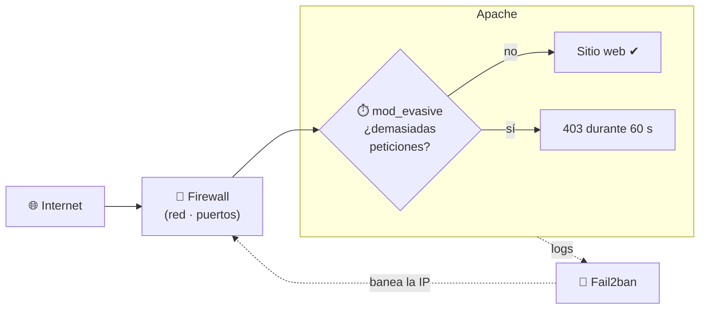

## 📒 5. Logs: Qué Pasó y Por Qué

Apache escribe dos tipos de log, y responden a preguntas distintas:

| Log | Qué registra | Pregunta que responde |
|---|---|---|
| `access.log` (o el `CustomLog` de cada sitio) | **Todas** las peticiones que llegan, con su código de estado | ¿Llegó la petición? ¿Qué devolvió Apache? |
| `error.log` (o el `ErrorLog` de cada sitio) | Lo que ha fallado y por qué | ¿**Por qué** ha dado 403 / 500? |

`access.log` te dice **que** hubo un 500; el **motivo** (una directiva mal escrita, un módulo que
falta, un permiso denegado, un error de sintaxis en `.htaccess`) está en `error.log`. Y si la petición
ni siquiera llega (DNS, red, cortafuegos), no aparecerá en ninguno de los dos.

### 5.1 Cómo leer una línea de `access.log`

```text title="Formato combined"
192.168.56.1 - - [30/Sep/2026:10:15:32 +0200] "GET /producto/42 HTTP/1.1" 500 612 "-" "curl/8.5.0"
```

| Trozo | Qué es |
|---|---|
| `192.168.56.1` | IP del cliente |
| `- -` | Identidad y usuario autenticado (casi siempre vacíos) |
| `[30/Sep/2026:10:15:32 +0200]` | Fecha y hora |
| `"GET /producto/42 HTTP/1.1"` | Método, ruta y versión de HTTP |
| `500` | Código de estado devuelto |
| `612` | Bytes enviados |
| `"-"` | *Referer*: desde qué página venía |
| `"curl/8.5.0"` | *User-Agent*: con qué programa se hizo la petición |

| Código | Significado habitual en este tema |
|---|---|
| `200` | Todo bien |
| `301` / `302` | Redirección (por ejemplo, la de HTTP → HTTPS) |
| `403` | Prohibido: `Require all denied`, `Options -Indexes`, permisos de la carpeta o `mod_evasive` |
| `404` | No existe: ruta o `DocumentRoot` mal escritos |
| `500` | Error del servidor: mira `error.log` |
| `502` / `504` | El *backend* (PHP-FPM) no responde o está saturado |

### 5.2 Comandos de diagnóstico

```bash title="Leer los logs como un administrador"
tail -f /var/log/apache2/sitioa_access.log                        # ver peticiones en tiempo real
tail -n 30 /var/log/apache2/sitioa_error.log                      # últimos errores
awk '{print $9}' /var/log/apache2/access.log | sort | uniq -c | sort -rn     # cuántos 200, 404, 500…
awk '{print $1}' /var/log/apache2/access.log | sort | uniq -c | sort -rn | head   # IPs que más piden
grep '" 404 ' /var/log/apache2/access.log | tail                  # últimos 404
```

El nivel de detalle de `error.log` se controla con `LogLevel` (por defecto `warn`). Súbelo solo
mientras depuras y solo para el módulo que te interese (por ejemplo `LogLevel warn rewrite:trace3`),
porque genera muchísimo texto.

### 5.3 Rotación de logs

Sin rotación, los logs de un sitio con tráfico real llenan el disco en semanas, y un disco lleno puede
tumbar el servidor entero. En Debian, el paquete ya instala `/etc/logrotate.d/apache2`, que **cada día**
archiva los logs, los comprime y conserva los de las últimas dos semanas, recargando Apache al
terminar:

```text title="/etc/logrotate.d/apache2 (resumen)"
/var/log/apache2/*.log {
        daily
        rotate 14
        compress
        delaycompress
        missingok
        notifempty
        create 640 root adm
        sharedscripts
        postrotate
                # recarga Apache para que empiece a escribir en el fichero nuevo
        endscript
}
```

Por eso verás en `/var/log/apache2/` ficheros como `access.log.1` y `access.log.2.gz`. Estos mismos logs
son la materia prima que, en SAD, analizará un SIEM como Wazuh.

## 🛠️ 6. Laboratorio Práctico Dirigido

### 6.1 Activar y verificar el sitio HTTPS

```bash title="Activar sitio, validar sintaxis y recargar" linenums="1"
a2ensite app-segura.conf
apachectl configtest
systemctl reload apache2
curl -I https://app.iaw.local/
```

```text title="Salida esperada del último comando"
HTTP/2 200
date: ...
server: Apache
strict-transport-security: max-age=63072000; includeSubDomains
content-type: text/html
```

`a2ensite` activa el VirtualHost (crea un enlace simbólico desde `sites-available` a `sites-enabled`,
justo el patrón del apartado 1.4); `apachectl configtest` es un paso que **nunca debe omitirse**:
valida la sintaxis del fichero antes de recargar, evitando dejar el servidor caído por un error
tipográfico en producción. Aquí sí usamos `reload` en vez de `restart`: solo estamos añadiendo un
VirtualHost nuevo, no cambiando el MPM, así que Apache puede releer su configuración sin cortar las
conexiones que ya estuvieran activas — la misma distinción volverá a aparecer en UD3 con Nginx.

```bash title="Verificación de que PHP no se ejecuta con mod_php residual" linenums="1"
apache2ctl -M | grep -i php   # No debe listar php_module
systemctl status php8.3-fpm
```

### 6.2 Sitio multi-dominio seguro

Ejercicio integrador (en parejas, unos 30 minutos). El orden de los pasos no es arbitrario: primero
defines **qué** sirve cada dominio, luego **con qué** módulos, luego la **seguridad**, y solo entonces
validas y recargas.

1. Crea `sitioa.iaw.local` y `sitiob.iaw.local` como dos VirtualHosts distintos, cada uno con su
   `DocumentRoot`, `ErrorLog` y `CustomLog` propios (apartado 2.2).
2. Revisa con `apache2ctl -M` qué módulos hacen falta (como mínimo `rewrite` si vas a usar reglas).
3. En `sitiob`, permite `.htaccess` (`AllowOverride`, apartado 3.2) y crea uno que proteja un
   `wp-config.php` de prueba y desactive el listado de directorios (apartado 3.3).
4. `apachectl configtest`.
5. `systemctl reload apache2` y verifica con `curl`, no solo con el navegador.

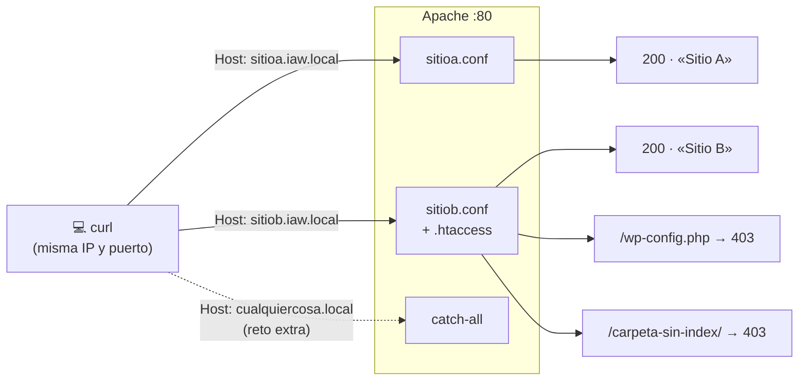

!!! success "Criterio de éxito"
    * `curl -H "Host: sitioa.iaw.local" http://localhost/` y `curl -H "Host: sitiob.iaw.local"
      http://localhost/` devuelven contenidos **distintos**.
    * `curl -I -H "Host: sitiob.iaw.local" http://localhost/wp-config.php` devuelve **403**, no 200.
    * Un directorio sin índice devuelve **403**, no un listado.

**Reto extra — VirtualHost por defecto (catch-all).** Crea un sitio que capture cualquier `Host` que no
coincida con los otros y no sirva contenido de nadie. Llámalo de forma que se cargue el primero:

```apache title="/etc/apache2/sites-available/000-catchall.conf"
<VirtualHost *:80>
    ServerName catchall.invalid
    <Location />
        Require all denied
    </Location>
</VirtualHost>
```

Compruébalo con `curl -I -H "Host: cualquiercosa.local" http://localhost/` (debe dar 403) y con
`apache2ctl -S` (debe aparecer como *default server*).

!!! warning "El error más común, con diferencia"
    Cambiar la configuración y **olvidar recargar Apache**. Si algo "no funciona" después de editar un
    fichero, la primera pregunta es siempre: ¿he hecho `reload`? La segunda: ¿qué dice `error.log`?

### 6.3 Mini-reto: auditar y corregir un Apache

Se te entrega un Apache ya configurado **con fallos a propósito**. En 15-20 minutos, localiza y
corrige:

* Módulos activos que no se usan (`apache2ctl -M`).
* `AllowOverride All` donde no hace falta.
* Directorios que muestran un listado "Index of /".
* Ficheros sensibles accesibles por URL.
* `ServerTokens` / `ServerSignature` revelando la versión.

Verifica cada corrección con `curl`, no solo leyendo el fichero de configuración.

## 🛡️ 7. Errores Comunes, Seguridad y Rendimiento

| Error | Por qué es un problema | Cómo se corrige |
|---|---|---|
| Módulos innecesarios activos (`status`, `info`, `autoindex`…) | Más superficie de ataque y fuga de información | `a2dismod` lo que no uses |
| `AllowOverride All` por defecto | Cada petición busca `.htaccess`; cualquiera que suba uno cambia la config | `None`, o solo los grupos necesarios |
| Listados de directorio olvidados | Exponen copias de seguridad, volcados, `.env`… | `Options -Indexes` |
| `ServerSignature On` / `ServerTokens Full` | Revelan la versión exacta, útil para buscar CVE | `ServerTokens Prod`, `ServerSignature Off` |
| MPM mal elegido | `prefork` con PHP-FPM desperdicia memoria; `event` con `mod_php` falla | Elegir el MPM según lo que ejecuta el sitio |
| `.htaccess` por todas partes en un servidor propio | Coste en cada petición | Mover la configuración al VirtualHost |
| Logs sin rotar | Llenan el disco y pueden tumbar el servidor | `logrotate` (apartado 5.3) |
| `restart` cuando bastaba `reload` | Corta **todas** las conexiones activas | `reload` salvo cambios estructurales |

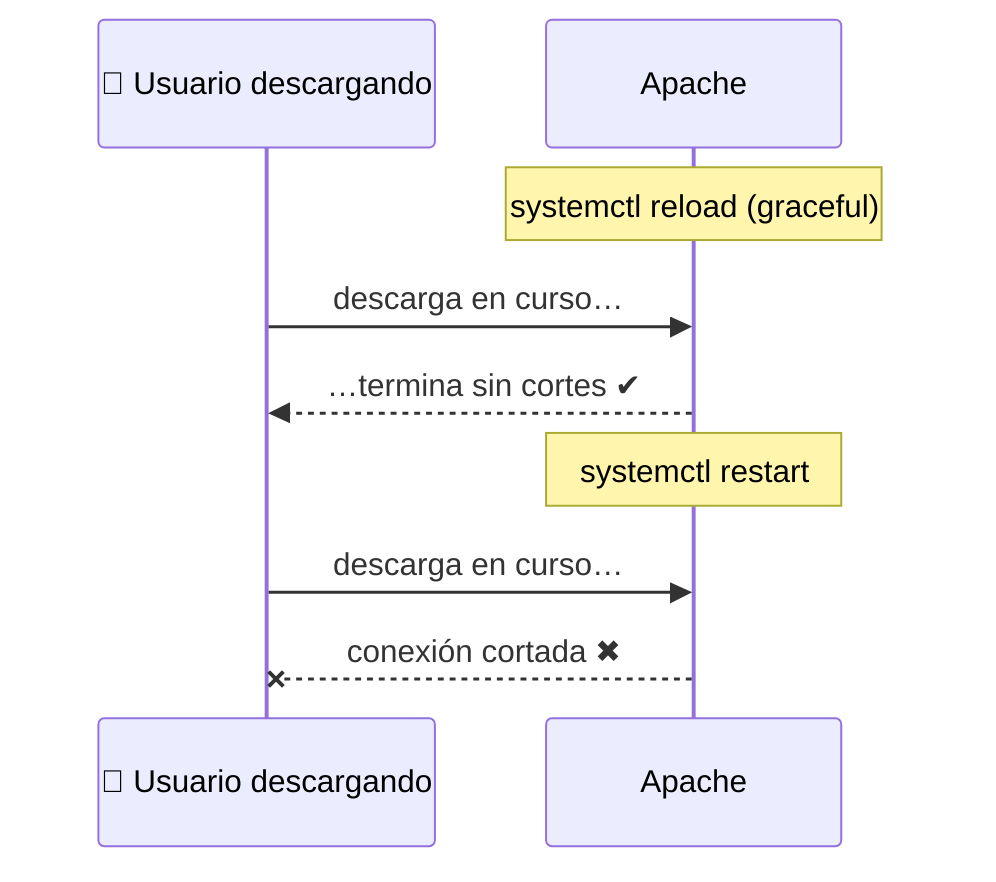

`restart` solo es necesario cuando cambia algo del propio proceso maestro (cambiar el MPM, tras
actualizar el binario de Apache); para sitios, módulos y `.htaccess`, `reload` basta.

**Rendimiento:**

* Ajuste de MPM event en `/etc/apache2/mods-available/mpm_event.conf`: `MaxRequestWorkers` debe
  dimensionarse según `RAM disponible / tamaño medio de proceso hijo`, evitando *swapping* bajo carga.
* `mod_status` (`/server-status`, restringido por IP) permite monitorizar *workers* activos en tiempo real.

!!! warning "Rendimiento y Cuellos de Botella"
    Con PHP-FPM externo, `pm.max_children` del *pool* (no `MaxRequestWorkers` de Apache) es el límite
    real de concurrencia de PHP; dimensionar ambos de forma descoordinada genera 502/504 bajo carga.

### 7.1 Diagnóstico rápido

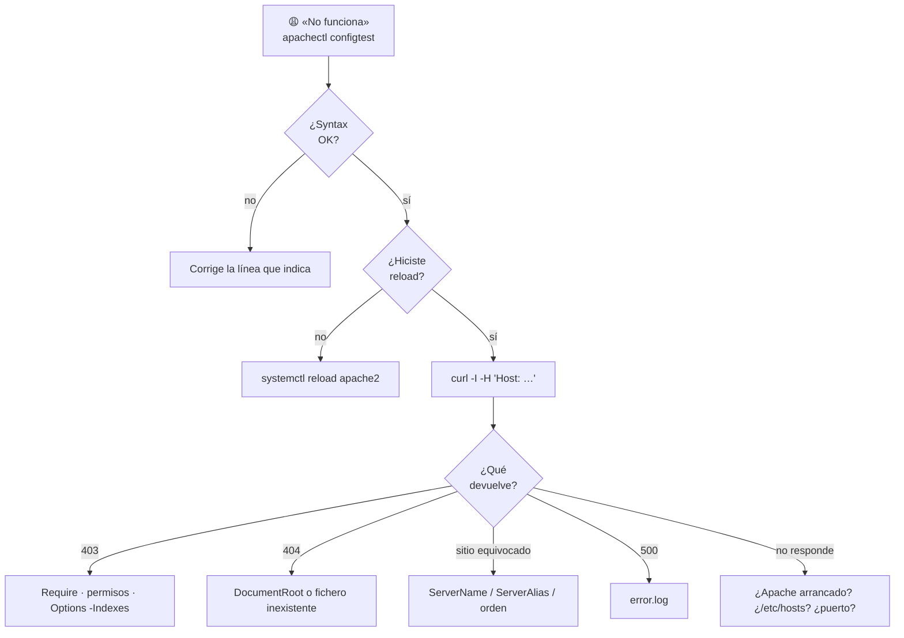

## ❓ 8. Preguntas y Casos de Autoevaluación

1. **¿Por qué no se puede combinar MPM `event` con `mod_php` clásico?**
   *Resolución:* `mod_php` no es *thread-safe*; MPM event usa hilos para gestionar conexiones keep-alive,
   lo que provocaría condiciones de carrera. Solución: PHP-FPM vía `mod_proxy_fcgi` (proceso separado).

2. **El sitio devuelve 502 Bad Gateway de forma intermitente. ¿Qué dos parámetros revisar primero?**
   *Resolución:* `pm.max_children` en el *pool* PHP-FPM (saturación) y `request_terminate_timeout`;
   también el *socket* `listen.backlog` si hay picos de conexión.

3. **¿Qué riesgo mitiga `Header unset X-Powered-By` y `ServerTokens Prod`?**
   *Resolución:* Reduce *fingerprinting* de versión exacta que facilitaría explotar CVEs conocidas
   de esa versión concreta (OWASP: *Information Exposure*, CWE-200).

4. **Diferencia entre `SetHandler` con socket UNIX y `ProxyPass` con `fcgi://127.0.0.1:9000`.**
   *Resolución:* El socket UNIX evita la pila TCP/IP local (menor latencia, sin puerto expuesto);
   TCP es necesario solo si PHP-FPM corre en otro host/contenedor.

5. **¿Por qué se recomienda TLS 1.3+1.2 y no dejar `SSLProtocol all`?**
   *Resolución:* `all` incluiría SSLv3/TLS1.0/1.1, protocolos con vulnerabilidades conocidas
   (POODLE, BEAST) y no conformes con CCN-STIC ni PCI-DSS 4.0.

6. **Tienes dos VirtualHosts en el puerto 443 y ninguno tiene el `ServerName` que pide el cliente. ¿Qué VirtualHost responde?**
   *Resolución:* El **primero definido** en el orden de carga de Apache (normalmente, el primer
   fichero activado alfabéticamente en `sites-enabled/`) — de ahí la importancia de tener siempre un
   VirtualHost por defecto explícito y controlado.

7. **Acabas de ejecutar `a2ensite` sobre un VirtualHost nuevo. ¿Con `reload` es suficiente, o hace falta `restart`?**
   *Resolución:* Con `reload` basta: añadir un VirtualHost es releer configuración, no cambiar el
   MPM ni otros parámetros estructurales del proceso maestro; `restart` solo es necesario para esos
   cambios estructurales (como el cambio de MPM hecho en la instalación).

8. **¿Qué diferencia hay entre `sites-available` y `sites-enabled`?**
   *Resolución:* `sites-available` guarda todos los sitios definidos (borradores); `sites-enabled` solo
   contiene enlaces simbólicos a los activos. `a2ensite`/`a2dissite` crean o borran ese enlace, y hace
   falta `reload` para aplicarlo.

9. **Has creado un `.htaccess` con `Options -Indexes` y el directorio se sigue listando. ¿Qué es lo primero que revisas?**
   *Resolución:* Que `AllowOverride` permita `.htaccess` en esa ruta: en Debian viene `AllowOverride
   None` para `/var/www/`, así que el fichero se ignora. (Y después, que hayas recargado Apache.)

10. **¿Qué pasaría si quitas `RewriteCond %{REQUEST_FILENAME} !-f` de las reglas de URLs amigables?**
    *Resolución:* Apache intentaría reescribir también las peticiones a ficheros reales (imágenes,
    CSS, JS), rompiendo su carga.

11. **Un usuario dice que la web "no carga". ¿Qué log miras y qué te dice cada uno?**
    *Resolución:* `access.log` dice si la petición llegó y qué código devolvió Apache; `error.log`
    explica por qué falló. Si no aparece en ninguno, el problema está antes de Apache (DNS, red,
    cortafuegos).

12. **¿Qué aporta `mod_evasive` que un cortafuegos tradicional no aporta por sí solo?**
    *Resolución:* Opera a nivel de aplicación (HTTP): cuenta peticiones por página y por sitio, algo
    que un cortafuegos que solo ve IPs y puertos no distingue. Son capas complementarias.
