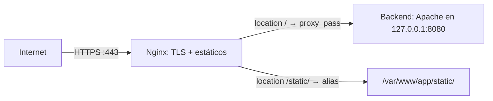

# UD3: Servidores de Alto Rendimiento: Nginx

!!! info "Ficha Técnica y Alcance de la Unidad"
    * **Carga Lectiva:** 4 horas presenciales
    * **Resultados de Aprendizaje:** RA1 (criterios g, h, i)
    * **Tecnologías Involucradas:** [Nginx](https://jmfiorisies.github.io/tech/nginx/)
    * **Referencias y Estándares:** CIS Nginx Benchmark, OWASP Secure Headers Project, RFC 7239 (cabecera `Forwarded`, la versión estándar de las `X-Forwarded-*`)

---

## 📖 1. Fundamentos Teóricos y Arquitectura

### 1.1 ¿Qué es un proxy inverso y por qué necesitamos uno?

Un **proxy** es un intermediario que recibe peticiones en nombre de otro. Ya conoces el "proxy
directo" (habitual en institutos/empresas): un servidor por el que *el cliente* pasa para salir a
Internet, normalmente para filtrar contenido. Un **proxy inverso** hace lo contrario: se coloca
delante *del servidor*, y es el propio servidor el que oculta su arquitectura interna detrás de él.

Imagina la recepción de un hotel: los huéspedes (clientes) siempre hablan con la recepción
(proxy inverso), nunca directamente con el departamento de limpieza, mantenimiento o cocina
(servidores internos). La recepción decide a qué departamento redirigir cada petición, y el huésped
ni siquiera necesita saber cuántos departamentos hay ni dónde están físicamente.

En nuestra arquitectura, Nginx cumplirá ese papel: recibirá **todas** las peticiones de Internet,
terminará el cifrado TLS ahí mismo, y decidirá si servir un fichero estático directamente o reenviar
la petición a otro programa interno (Apache, o en UD5 una aplicación Python) que no está expuesto
directamente a Internet.



### 1.2 ¿Por qué Nginx es más eficiente que el modelo de procesos e hilos de Apache?

En UD2 vimos los MPM de Apache: con `prefork` hay un proceso por conexión; con `worker`, un hilo por
conexión; y con `event` (el que viene de serie), un hilo por cada petición en curso, que solo se
libera de las conexiones *keep-alive* que están esperando sin hacer nada. En los tres casos, mientras
se atiende una petición hay un proceso o un hilo ocupado con ella, aunque esté parado esperando al
disco o a la red.

Nginx sigue un enfoque distinto: un modelo **asíncrono orientado a eventos**. En vez de "un
trabajador dedicado por cliente", Nginx tiene un número reducido de procesos *worker* (normalmente
uno por núcleo de CPU) que van atendiendo miles de conexiones sin bloquearse esperando a ninguna de
ellas — de forma parecida a un único camarero muy ágil que va tomando nota en varias mesas mientras
la cocina prepara cada plato, en vez de un camarero fijo esperando parado junto a cada mesa hasta
que su plato esté listo.

Técnicamente, esto se apoya en mecanismos del kernel de Linux como `epoll`, que permiten a un
programa preguntar "¿hay alguna de estas mil conexiones con datos nuevos?" de forma muy eficiente, en
vez de tener que revisarlas una a una constantemente.

Esta arquitectura es idónea como **proxy inverso / balanceador** delante de Apache, PHP-FPM o
aplicaciones Python (Gunicorn/Uvicorn, ver UD5), terminando TLS y sirviendo estático de forma muy
eficiente sin sobrecargar a los servidores de aplicación con ese trabajo.

### 1.3 Lo que el backend deja de "ver" al estar detrás de un proxy

Cuando Nginx reenvía una petición al backend, esa conexión interna es *nueva*: el backend recibiría
como IP de origen la del propio Nginx, no la del cliente real, salvo que se lo digamos explícitamente
mediante cabeceras HTTP adicionales (esto se resuelve con `X-Real-IP` y `X-Forwarded-*`, que veremos
en la configuración). Es importante entenderlo bien porque es una fuente de errores muy habitual: un
log de acceso del backend que muestre siempre la misma IP casi siempre significa que faltan esas
cabeceras.

## ⚙️ 2. Instalación, Configuración Avanzada y Hardening

```bash title="Instalación en Debian/Ubuntu" linenums="1"
sudo apt update && sudo apt install -y nginx
nginx -v          # Debian 13: nginx/1.26 · Ubuntu 24.04: nginx/1.24
```

El paquete de Debian/Ubuntu organiza la configuración igual que Apache en UD2:

| Ruta | Para qué sirve |
|---|---|
| `/etc/nginx/nginx.conf` | Configuración global: *workers*, `events {}` y el bloque `http {}` |
| `/etc/nginx/conf.d/*.conf` | Se incluyen **dentro de `http {}`**: solo directivas de ese nivel (zonas de `limit_req`, `log_format`, `gzip_types`…). Un `location` aquí da error |
| `/etc/nginx/sites-available/` | Un fichero por sitio (bloques `server {}`) |
| `/etc/nginx/sites-enabled/` | Los sitios activos. No hay `a2ensite`: se activan con un enlace simbólico |

!!! note "¿Y el repositorio oficial de nginx.org?"
    Si necesitas la última versión, nginx.org tiene su propio repositorio. Ten en cuenta que esos
    paquetes no traen `sites-available`/`sites-enabled`: todo va en `conf.d/`. En clase usamos el
    paquete de la distribución.

```nginx title="/etc/nginx/sites-available/app.conf" linenums="1"
server {
    listen 443 ssl;
    http2 on;    # Nginx >= 1.25.1. En la 1.24 (Ubuntu 24.04): listen 443 ssl http2;
    server_name app.iaw.local;

    ssl_certificate     /etc/ssl/lab/lab.crt;
    ssl_certificate_key /etc/ssl/lab/lab.key;
    ssl_protocols TLSv1.3 TLSv1.2;
    ssl_session_cache shared:SSL:10m;

    add_header Strict-Transport-Security "max-age=63072000; includeSubDomains" always;
    add_header X-Content-Type-Options "nosniff" always;
    add_header X-Frame-Options "SAMEORIGIN" always;

    # Cabeceras para el backend. Puestas a nivel de server, las heredan todos los location
    proxy_set_header Host $host;
    proxy_set_header X-Real-IP $remote_addr;
    proxy_set_header X-Forwarded-For $proxy_add_x_forwarded_for;
    proxy_set_header X-Forwarded-Proto $scheme;

    location / {
        proxy_pass http://127.0.0.1:8080;
    }

    location /static/ {
        alias /var/www/app/static/;
        expires 30d;
        access_log off;
    }
}
server {
    listen 80;
    server_name app.iaw.local;
    return 301 https://$host$request_uri;
}
```

```bash title="Activar el sitio" linenums="1"
sudo ln -s /etc/nginx/sites-available/app.conf /etc/nginx/sites-enabled/
```

Cada bloque `location` le dice a Nginx cómo tratar peticiones según la ruta pedida: el bloque `/`
reenvía (`proxy_pass`) todo lo que no sea explícitamente estático hacia el backend interno en el
puerto 8080; el bloque `/static/` sirve directamente los ficheros de ese directorio sin pasar por el
backend, mucho más rápido para imágenes/CSS/JS. El segundo bloque `server` (puerto 80) simplemente
redirige cualquier visita sin cifrar hacia la versión HTTPS (`301` = redirección permanente).

`X-Real-IP`, `X-Forwarded-For` y `X-Forwarded-Proto` le dicen al backend la IP y el esquema
(`http`/`https`) originales del cliente. No son un estándar oficial, sino una convención que entiende
casi todo el software; la versión estandarizada es la cabecera `Forwarded` (RFC 7239). Sin ellas,
los logs y el control de acceso del backend verían siempre `127.0.0.1`, como se explicaba en el
punto 1.3. Ojo: si un `location` define su propio `proxy_set_header`, deja de heredar **todos** los
del `server`.

!!! warning "Apache y Nginx en la misma máquina"
    Solo un programa puede escuchar en cada puerto. Si Apache de UD2 sigue en el 80/443, Nginx no
    arranca (`Address already in use`). Para ponerlo detrás de Nginx, en `/etc/apache2/ports.conf`
    cambia a `Listen 127.0.0.1:8080`, pasa su VirtualHost a `<VirtualHost *:8080>` sin TLS
    (el cifrado lo hace ahora Nginx), desactiva el sitio en el 443 y reinicia Apache.

!!! danger "HSTS con un certificado autofirmado"
    Con `Strict-Transport-Security`, el navegador recuerda durante `max-age` segundos que ese dominio
    solo va por HTTPS y **ya no deja aceptar el aviso** del certificado autofirmado. En el laboratorio
    usa un valor corto (`max-age=300`) o pruébalo solo con `curl`; el valor de dos años es para
    producción con un certificado válido.

## 🛠️ 3. Laboratorio Práctico Dirigido

Antes de probar necesitas:

- El certificado de UD1/UD2 en `/etc/ssl/lab/lab.crt` y `lab.key`.
- Un backend escuchando en `127.0.0.1:8080` (por ejemplo, el Apache de UD2 movido a ese puerto).
- Que `app.iaw.local` apunte a tu máquina: añade `127.0.0.1 app.iaw.local` a `/etc/hosts`.

```bash title="Validar, recargar y comprobar" linenums="1"
sudo nginx -t && sudo systemctl reload nginx
curl -I http://app.iaw.local/      # 301 con Location: https://app.iaw.local/
curl -Ik https://app.iaw.local/    # 200 con la cabecera strict-transport-security
```

`nginx -t` comprueba la sintaxis sin tocar el servicio: si falla, el `&&` impide el `reload` y Nginx
sigue funcionando con la configuración anterior. `systemctl reload` (a diferencia de `restart`)
aplica la nueva configuración sin cerrar las conexiones ya activas: Nginx termina de atender las
peticiones en curso con la configuración antigua y empieza a usar la nueva para las siguientes —
imprescindible en un servidor en producción con usuarios conectados. La `-k` de `curl` acepta el
certificado autofirmado.

!!! tip "Si algo falla"
    * `502 Bad Gateway`: Nginx funciona, pero no hay nada en el backend. Compruébalo con
      `ss -tlnp | grep 8080`.
    * `Address already in use`: otro programa (¿Apache?) ocupa el 80 o el 443.
    * `"location" directive is not allowed here`: has puesto un `location` fuera de un `server {}`
      (por ejemplo, en `conf.d/`).
    * El error exacto, con fichero y línea, está en `/var/log/nginx/error.log`.

## 🛡️ 4. Seguridad, Logs y Optimización de Rendimiento

```nginx title="/etc/nginx/nginx.conf (extracto)" linenums="1"
worker_processes auto;          # un worker por núcleo de CPU
worker_rlimit_nofile 65535;     # descriptores de fichero que puede abrir cada worker

events {
    worker_connections 4096;    # conexiones simultáneas por worker (Debian trae 768)
}
```

* El número máximo de conexiones simultáneas es aproximadamente `worker_processes ×
  worker_connections`. Como proxy, cada cliente gasta **dos** conexiones (la del cliente y la del
  backend), así que caben la mitad de clientes. Si se quedan cortas, en `error.log` aparece
  `worker_connections are not enough`.
* `worker_rlimit_nofile` eleva el límite de descriptores de fichero de cada worker (cada conexión es
  un descriptor); tiene que ser mayor que `worker_connections` o aparecerá `Too many open files`.
* Logs: `/var/log/nginx/access.log` y `error.log`. Con `log_format … escape=json` (en contexto
  `http`) se pueden escribir en JSON, el formato recomendado para enviarlos a un SIEM.
* `limit_req_zone` mitiga *brute-force* y *DoS* de capa 7 sin depender del backend.

El limitador se define en dos sitios, porque cada directiva va en un contexto distinto:

```nginx title="/etc/nginx/conf.d/limites.conf (contexto http)" linenums="1"
limit_req_zone $binary_remote_addr zone=login:10m rate=10r/m;
limit_req_status 429;
```

```nginx title="Dentro del server {} de sites-available/app.conf" linenums="1"
location /login {
    limit_req zone=login burst=5 nodelay;
    proxy_pass http://127.0.0.1:8080;
}
```

Esta configuración limita a 10 peticiones por minuto por IP (`rate=10r/m`, una cada 6 segundos) la
ruta `/login`, con un margen de ráfaga de 5 peticiones más (`burst=5`) que se atienden al momento
(`nodelay`): un usuario legítimo que se equivoca un par de veces no nota nada, pero un script que
prueba contraseñas recibe enseguida `429 Too Many Requests`. Sin `limit_req_status 429`, Nginx
respondería `503 Service Unavailable`, que confunde porque parece que el servidor está caído.

## ❓ 5. Preguntas y Casos de Autoevaluación

1. **¿Por qué Nginx soporta más conexiones concurrentes con menos RAM que Apache prefork?**
   *Resolución:* Modelo asíncrono orientado a eventos (un worker atiende miles de conexiones no
   bloqueantes) frente a un proceso por conexión con su propio *stack* de memoria.

2. **Los logs del backend muestran siempre la IP del proxy (`127.0.0.1`) en vez de la del cliente.
   ¿Causa?**
   *Resolución:* Faltan las cabeceras `X-Real-IP`/`X-Forwarded-For` (`proxy_set_header`), o el
   backend no está configurado para confiar en ellas (en Apache, `mod_remoteip` con
   `RemoteIPHeader X-Forwarded-For` y `RemoteIPInternalProxy 127.0.0.1`).

3. **¿Qué diferencia hay entre `alias` y `root` en un bloque `location` de Nginx?**
   *Resolución:* `root` añade la URI **completa** a la ruta base (`root /var/www/app;` +
   `/static/logo.png` → `/var/www/app/static/logo.png`); `alias` **sustituye** la parte de la URI
   que coincide con el `location` (`location /static/ { alias /var/www/app/static/; }` → la misma
   ruta). Error común: poner la barra final en uno y no en el otro.

4. **Justifica el uso de `limit_req_zone` frente a bloquear IPs manualmente.**
   *Resolución:* Es dinámico y basado en tasa (peticiones por segundo o minuto) sin mantenimiento de
   listas; complementa (no sustituye) un WAF/fail2ban para bloqueo persistente tras umbral de abuso.

5. **¿Qué relación hay entre `worker_connections` y `worker_rlimit_nofile`?**
   *Resolución:* `worker_connections` fija cuántas conexiones atiende cada worker; cada conexión es
   un descriptor de fichero, y `worker_rlimit_nofile` es el límite de descriptores del worker (el del
   sistema, `ulimit -n`, suele ser 1024). El segundo debe ser mayor que el primero; como proxy, cada
   cliente usa dos conexiones.

6. **`nginx -t` dice `"location" directive is not allowed here in /etc/nginx/conf.d/limites.conf`.
   ¿Qué pasa?**
   *Resolución:* Los ficheros de `conf.d/` se incluyen dentro de `http {}`, y un `location` solo
   puede ir dentro de un `server {}`. La zona (`limit_req_zone`) se queda en `conf.d/`; el
   `location` con `limit_req` va en el fichero del sitio.
